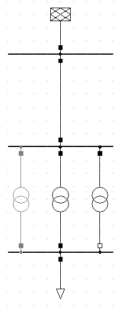

================================
Tests and Validation
================================

Unit Tests
========================

pandapower is tested with pytest. There are currently over 100 unit tests testing all kinds of pandapower functionality.

The complete test suit can be run with: ::

        import pandapower.test
        pandapower.test.run_all_tests()
    
If all packages are installed correctly, all tests should pass.

Model and Loadflow Validation
=============================
To ensure that pandapower loadflow results are correct, all pandapower element behaviour is tested against DIgSILENT PowerFactory or PSS Sincal. 

There is a result test for each of the pandapower elements that checks loadflow results in pandapower against results from a commercial tools. 
The results are compared with the following tolerances:

.. tabularcolumns:: |l|l|
.. csv-table:: 
   :file: tolerances.csv
   :delim: ;
   :widths: 30, 30
   
   
**Example: Transformer**

To validate the pandapower transformer model, a transformer is created with the same parameters in pandapower and PowerFactory. To test all aspects of the model we use a transformer with

    - both iron and copper losses > 0
    - different nominal voltages than the bus nominal voltage at both sides
    - a tap changer with tp_mid != tp_pos
    - a voltage angle shift > 0

We use a transformer with the following parameters:

    - vsc_percent=5.
    - vscr_percent=2.
    - i0_percent=.4
    - pfe_kw=2
    - sn_kva=400
    - vn_hv_kv=22
    - vn_lv_kv=0.42
    - tp_max=10
    - tp_mid=5
    - tp_min=0
    - tp_st_percent=1.25
    - tp_side="hv"
    - tp_pos=3
    - shift_degree=150

To validate the in_service parameter as well as the transformer switch element, we create three transformers in parallel: one in service, on out of service and one with an open switch in open loop operation.
All three transformers are connected to a 20kV / 0.4 kV bus network. The test network then looks like this:

    
The loadflow result for the exact same network are now compared in pandapower and PowerFactory. It can be seen that both bus voltages:

.. image:: ../pics/validation/validation_bus.png
	:width: 20em
	:align: center

and transformer results:

.. image:: ../pics/validation/validation_trafo.png
	:width: 60em
	:align: center

match with the error tolerancse defined above.    

    
A test like this exists for all pandapower elements:

 - line
 - load / sgen
 - trafo
 - trafo3w
 - ext_grid
 - shunt
 - gen
 - impedance
 - ward
 - xward
 - bus-bus switch
 
The PowerFactory file containing all test networks can be downloaded :download:`here  <../../pandapower/test/test_files/test_results.pfd>`.
The correlating pandapower networks are defined in result_test_network_generatory.py in the pandapower/test module.
The tests that check pandapower results against PowerFactory results are located in pandapower/test/test_results.py.