.. _tests:

================================
Tests and Validation
================================

Unit Tests
========================

pandapower is tested with pytest. There are currently over 100 tests testing all kinds of pandapower functionality.

The complete test suite can be run with: ::

        import pandapower.test
        pandapower.test.run_all_tests()
    
If all packages are installed correctly, all tests should pass.

pandapower is tested with python 2.7: ::

    ============================= test session starts =============================
    platform win32 -- Python 2.7.12, pytest-3.0.5, py-1.4.32, pluggy-0.4.0
    collected 139 items 

    ..\..\Documents\pandapower\pandapower\test\api\test_auxiliary.py .
    ..\..\Documents\pandapower\pandapower\test\api\test_diagnostic.py ....................
    ..\..\Documents\pandapower\pandapower\test\api\test_file_io.py ..
    ..\..\Documents\pandapower\pandapower\test\api\test_std_types.py ..........
    ..\..\Documents\pandapower\pandapower\test\api\test_toolbox.py .....
    ..\..\Documents\pandapower\pandapower\test\converter\test_from_ppc.py ....
    ..\..\Documents\pandapower\pandapower\test\converter\test_to_ppc.py .
    ..\..\Documents\pandapower\pandapower\test\estimation\test_wls_estimation.py ...........
    ..\..\Documents\pandapower\pandapower\test\loadflow\test_results.py ..................
    ..\..\Documents\pandapower\pandapower\test\loadflow\test_runpp.py ......
    ..\..\Documents\pandapower\pandapower\test\loadflow\test_scenarios.py .....
    ..\..\Documents\pandapower\pandapower\test\networks\test_cigre_networks.py ...
    ..\..\Documents\pandapower\pandapower\test\networks\test_create_example.py ..
    ..\..\Documents\pandapower\pandapower\test\networks\test_ieee_cases.py .........
    ..\..\Documents\pandapower\pandapower\test\networks\test_kerber_networks.py .................
    ..\..\Documents\pandapower\pandapower\test\networks\test_simple_pandapower_test_networks.py ....
    ..\..\Documents\pandapower\pandapower\test\opf\test_basic.py .......
    ..\..\Documents\pandapower\pandapower\test\opf\test_curtailment.py .
    ..\..\Documents\pandapower\pandapower\test\opf\test_dcline.py ..
    ..\..\Documents\pandapower\pandapower\test\opf\test_oberrhein.py .
    ..\..\Documents\pandapower\pandapower\test\shortcircuit\test_line_gen.py ..
    ..\..\Documents\pandapower\pandapower\test\shortcircuit\test_line_transformer.py ....
    ..\..\Documents\pandapower\pandapower\test\shortcircuit\test_meshing_detection.py ....

    ========================= 139 passed in 88.13 seconds =========================

python 3.4: ::

    ============================= test session starts =============================
    platform win32 -- Python 3.4.4, pytest-3.0.5, py-1.4.32, pluggy-0.4.0
    hp.pandapower.shortcircuit - WARNING: WARNING: pandapower shortcircuit module is in beta stadium, proceed with caution!
    collected 139 items

    ..\..\Documents\pandapower\pandapower\test\api\test_auxiliary.py .
    ..\..\Documents\pandapower\pandapower\test\api\test_diagnostic.py ...................
    ..\..\Documents\pandapower\pandapower\test\api\test_file_io.py ..
    ..\..\Documents\pandapower\pandapower\test\api\test_std_types.py ..........
    ..\..\Documents\pandapower\pandapower\test\api\test_toolbox.py .....
    ..\..\Documents\pandapower\pandapower\test\converter\test_from_ppc.py ....
    ..\..\Documents\pandapower\pandapower\test\converter\test_to_ppc.py .
    ..\..\Documents\pandapower\pandapower\test\estimation\test_wls_estimation.py ...........
    ..\..\Documents\pandapower\pandapower\test\loadflow\test_results.py ..................
    ..\..\Documents\pandapower\pandapower\test\loadflow\test_runpp.py ......
    ..\..\Documents\pandapower\pandapower\test\loadflow\test_scenarios.py .....
    ..\..\Documents\pandapower\pandapower\test\networks\test_cigre_networks.py ...
    ..\..\Documents\pandapower\pandapower\test\networks\test_create_example.py ..
    ..\..\Documents\pandapower\pandapower\test\networks\test_ieee_cases.py .........
    ..\..\Documents\pandapower\pandapower\test\networks\test_kerber_networks.py .................
    ..\..\Documents\pandapower\pandapower\test\networks\test_simple_pandapower_test_networks.py ....
    ..\..\Documents\pandapower\pandapower\test\opf\test_basic.py .......
    ..\..\Documents\pandapower\pandapower\test\opf\test_curtailment.py .
    ..\..\Documents\pandapower\pandapower\test\opf\test_dcline.py ..
    ..\..\Documents\pandapower\pandapower\test\opf\test_oberrhein.py .
    ..\..\Documents\pandapower\pandapower\test\shortcircuit\test_line_gen.py ..
    ..\..\Documents\pandapower\pandapower\test\shortcircuit\test_line_transformer.py ....
    ..\..\Documents\pandapower\pandapower\test\shortcircuit\test_meshing_detection.py ....

    ========================= 139 passed in 92.21 seconds =========================

and python 3.5: ::

    ============================= test session starts =============================
    platform win32 -- Python 3.5.1, pytest-3.0.5, py-1.4.31, pluggy-0.4.0
    collecting 129 itemshp.pandapower.shortcircuit - WARNING: WARNING: pandapower shortcircuit module is in beta stadium, proceed with caution!
    collected 139 items

    ..\pandapower\test\api\test_auxiliary.py .
    ..\pandapower\test\api\test_diagnostic.py ....................
    ..\pandapower\test\api\test_file_io.py ..
    ..\pandapower\test\api\test_std_types.py ..........
    ..\pandapower\test\api\test_toolbox.py .....
    ..\pandapower\test\converter\test_from_ppc.py ....
    ..\pandapower\test\converter\test_to_ppc.py .
    ..\pandapower\test\estimation\test_wls_estimation.py ...........
    ..\pandapower\test\loadflow\test_results.py ..................
    ..\pandapower\test\loadflow\test_runpp.py ......
    ..\pandapower\test\loadflow\test_scenarios.py .....
    ..\pandapower\test\networks\test_cigre_networks.py ...
    ..\pandapower\test\networks\test_create_example.py ..
    ..\pandapower\test\networks\test_ieee_cases.py .........
    ..\pandapower\test\networks\test_kerber_networks.py .................
    ..\pandapower\test\networks\test_simple_pandapower_test_networks.py ....
    ..\pandapower\test\opf\test_basic.py .......
    ..\pandapower\test\opf\test_curtailment.py .
    ..\pandapower\test\opf\test_dcline.py ..
    ..\pandapower\test\opf\test_oberrhein.py .
    ..\pandapower\test\shortcircuit\test_line_gen.py ..
    ..\pandapower\test\shortcircuit\test_line_transformer.py ....
    ..\pandapower\test\shortcircuit\test_meshing_detection.py ....

    ========================= 139 passed in 72.78 seconds =========================     

Model and Loadflow Validation
=============================
To ensure that pandapower loadflow results are correct, all pandapower element behaviour is tested against DIgSILENT PowerFactory or PSS Sincal. 

There is a result test for each of the pandapower elements that checks loadflow results in pandapower against results from a commercial tools. 
The results are compared with the following tolerances:

.. tabularcolumns:: |l|l|
.. csv-table:: 
   :file: tolerances.csv
   :delim: ;
   :widths: 30, 30

Example: Transformer Model Validation
--------------------------------------

To validate the pandapower transformer model, a transformer is created with the same parameters in pandapower and PowerFactory. To test all aspects of the model we use a transformer with

    - both iron and copper losses > 0
    - nominal voltages that deviate from the nominal bus voltages at both sides
    - an active tap changer
    - a voltage angle shift > 0

We use a transformer with the following parameters:

    - vsc_percent= 5.0
    - vscr_percent = 2.0
    - i0_percent = 0.4
    - pfe_kw = 2.0
    - sn_kva = 400
    - vn_hv_kv = 22
    - vn_lv_kv = 0.42
    - tp_max = 10
    - tp_mid = 5
    - tp_min = 0
    - tp_st_percent = 1.25
    - tp_side = "hv"
    - tp_pos = 3
    - shift_degree = 150

To validate the in_service parameter as well as the transformer switch element, we create three transformers in parallel: one in service, on out of service and one with an open switch in open loop operation.
All three transformers are connected to a 20kV / 0.4 kV bus network. The test network then looks like this:

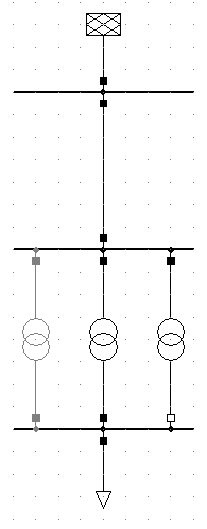
    
The loadflow result for the exact same network are now compared in pandapower and PowerFactory. It can be seen that both bus voltages:

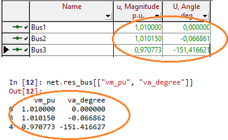

and transformer results:

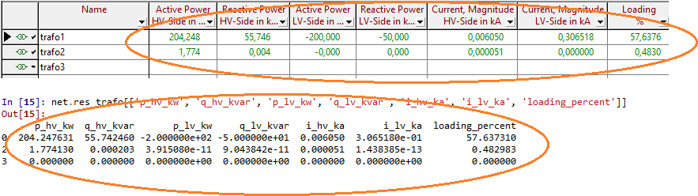

match within the margins defined above.

All Test Networks
-------------------------------------

There is a test network for the validation of each pandapower element in the same way the transformer model is tested.

The PowerFactory file containing all test networks can be downloaded :download:`here  <../../pandapower/test/test_files/test_results.pfd>`.
The correlating pandapower networks are defined in result_test_network_generatory.py in the pandapower/test module.
The tests that check pandapower results against PowerFactory results are located in pandapower/test/test_results.py.

**line**
 
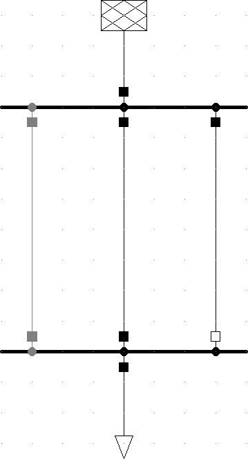

**load and sgen**

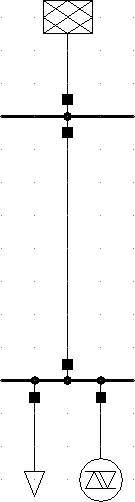

**trafo**

    
**trafo3w**

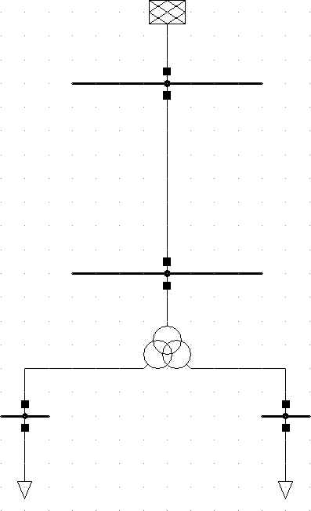

**ext_grid**

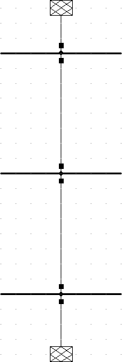
    
**shunt**

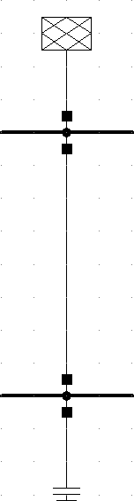

**gen**

.. image:: ../pics/validation/test_gen.PNG
	:width: 20em
	:align: center  
    
**impedance**

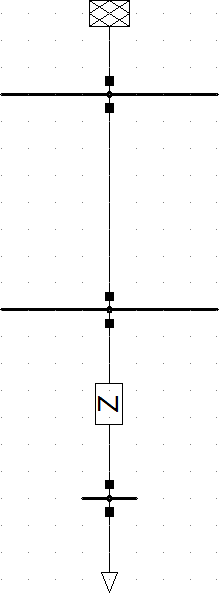
    
**ward**

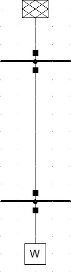
    
**xward**

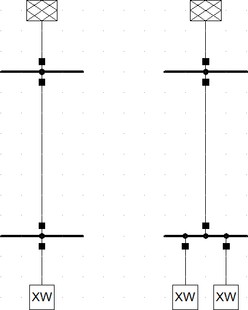

**switch**

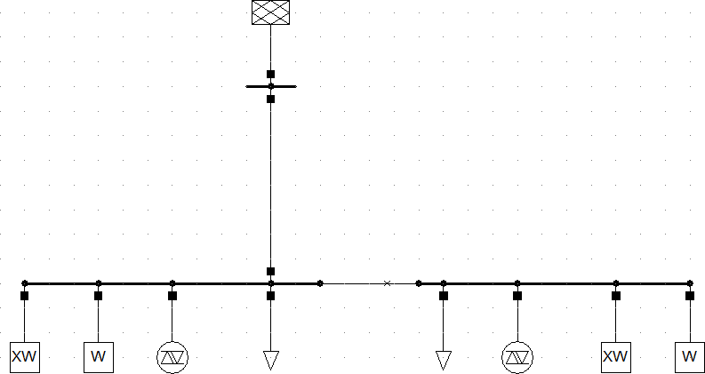

    
