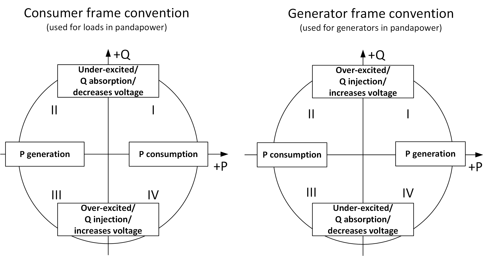

.. _conventions:

============================    
Unit System and Conventions
============================

**Naming Conventions**

Parameters are always named in the form of <parameter>_<unit>,
 
However, for three phase load flow the notation is like <parameter>_<phase>_<unit>:

.. tabularcolumns:: |l|l|
.. csv-table:: 
   :file: nameing1.csv
   :delim: ;
   :widths: 30, 30

Constraint parameters are always named with max or min as the prefix to the variable which is constrained, for example:

.. tabularcolumns:: |l|l|
.. csv-table:: 
   :file: nameing2.csv
   :delim: ;
   :widths: 30, 30

It is advised to keep consistent with these naming conventions when extending the framework and introducing new parameters.
   
**Three Phase System (Balanced Load Flow)**

For balanced three phase systems, the following conventions apply:

    - voltage values are given as phase-to-phase voltages
    - current values are given as phase currents
    - power values are given as aggregated three-phase power 

So for balanced system, three-phase power is three times the single phase power i.e. : 

:math:`S = 3 \cdot V_{ph-e} \cdot I_{ph-e}`

Assuming Wye connected loads, phase-to-earth voltage    :math:`v_{ph-e} = \frac{V_{ph-ph}}{\sqrt3}`

The power equation in the balanced three phase system is therefore given as :math:`S = \sqrt3 \cdot V_{ph-ph} \cdot I_{ph-ph}`.

**Three Phase System (Unbalanced Load Flow)**

For unbalanced three phase systems, the following conventions apply:
    - voltage values are entered as phase-to-phase voltages
    - current values are entered as phase currents
    - But, Phase power values can be entered seperately in the new element **asymmetric_load** 

The power equation in each phase is therefore given as :math:`S_{ph-e} = \frac{V_{ph-ph} \cdot I_{ph-ph}}{\sqrt3 }`.
	
.. note::

	- Even though voltage values are fed as phase-phase voltage for simplicity, internally its converted to phase-earth for calculation.
	- So, if you want to take out actual voltage values from p.u values , you need to divide base_kv value by :math:`\sqrt3` :

	:math:`v_{an} = \frac{V_{ab}}{\sqrt3}`

	- All power values are given in MW / MVA / MVar except the iron losses of transformers which are given in kW (pfe_kw).

**Per Unit System**

Bus voltages are given in the per unit system. The per unit values are relative to the phase-to-phase voltages defined in net.bus.vn_kv for each bus. 

The rated apparent power for the per unit system can be defined with the net.sn_mva parameter when creating an empty network. The default value is :math:`S_{N} = 1 MVA`.
The value should not be relevant in most applications since all power values are given in physical units.

**Signing System**

The reference system for bus elements can be summarized with the following figure:

There are three bus elements that have power values based on the generator viewpoint (positive active power means power generation), which are:
    - gen
    - sgen
    - ext_grid
    
For all other bus elements the signing is based on the consumer viewpoint (positive active power means power consumption):
    - bus
    - load
    - shunt
    - ward
    - xward
    - storage
 
The power flow values for branch elements (e.g. lines & transformers) are always defined as the power flow into the branch element (positive values means power flows into the element, negative power means power flows out of the element).

**Frequency**

The frequency can be defined when creating an empty network. The frequency is only used to calculate the shunt admittance of lines, since the line reactance is given directly in ohm per kilometer.
The frequency is also relevant when calculating the peak factor :math:`\kappa` in the short circuit calculation.

The standard frequency in pandapower is 50 Hz, and the pandapower standard types are also chosen for 50 Hz systems. If you use a different frequency, please be aware that the line reactance values might not be realistic.
