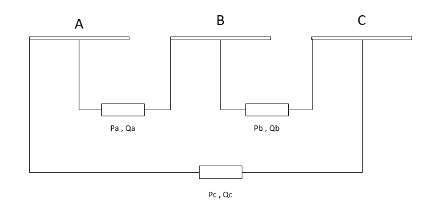

.. _asymmetric_load:

===============
Asymmetric Load
===============

.. note::

   Loads should always have a positive p_mw value, since all power values are given in the consumer system. If you want to model constant generation, use a Static Generator (sgen element) instead of a negative load.

.. seealso::
    :ref:`Unit Systems and Conventions <conventions>`

Create Function
=====================

.. autofunction:: pandapower.create_asymmetric_load

Input Parameters
=====================

*net.asymmetric_load*

.. tabularcolumns:: |p{0.10\linewidth}|p{0.10\linewidth}|p{0.25\linewidth}|p{0.40\linewidth}|

.. csv-table::
   :file: asymmetric_load_par.csv
   :delim: ;
   :widths: 10, 10, 25, 40

\*necessary for executing a power flow calculation.

.. note::
    
    - The apparent power value sn_mva is provided as additional information for usage in controller or other applications based on panadapower. It is not considered in the power flow!
    
    - The type 'wye' is the same as Load Technology  PH-E loads

Electric Model
=================

Loads are modelled as PQ-buses in the power flow calculation. 

*Wye Load*

.. image:: asym_wye_load.png
	:width: 40em
	:alt: alternate Text
	:align: center
*Delta Load*

Result Parameters
==========================    
*net.res_asymmetric_load*

.. tabularcolumns:: |p{0.10\linewidth}|p{0.10\linewidth}|p{0.45\linewidth}|
.. csv-table:: 
   :file: load_asymmetric_res.csv
   :delim: ;
   :widths: 10, 10, 45
   
The power values in the net.res_asymmetric_load table are equivalent to :math:`P_{a,b,c}{load}` and :math:`Q_{a,b,c}{load}`.

