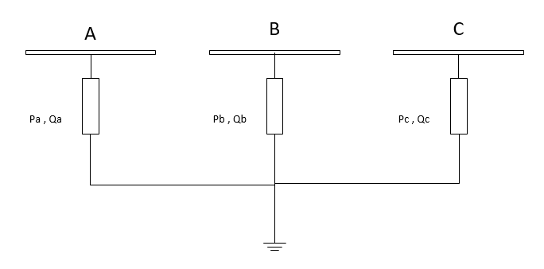

.. _asymmetric_load:

===============
Asymmetric Load
===============

.. note::

    Loads should always have a positive p_mw value, since all power values are given in the consumer system. If you want to model constant generation, use a Static Generator (asymmetric_sgen element) instead of a negative load.
	
.. seealso::
    :ref:`Unit Systems and Conventions <conventions>`

Create Function
=====================

.. autofunction:: pandapower.create_asymmetric_load

Input Parameters
=====================

*net.asymmetric_load*

.. tabularcolumns:: |p{0.10\linewidth}|p{0.10\linewidth}|p{0.25\linewidth}|p{0.40\linewidth}|

.. csv-table::
   :file: asymmetric_load_par.csv
   :delim: ;
   :widths: 10, 10, 25, 40

\*necessary for executing a power flow calculation.

.. note::
    
    - The apparent power value sn_mva is provided as additional information for usage in controller or other applications based on panadapower. It is not considered in the power flow!
    
    - 'wye' is the same as PH-E loads

    - For 'delta' loads line-earth voltages and powers are converted to line-line values

Electric Model
=================

Loads are modelled as PQ-buses in the power flow calculation. 

*Wye Load*

*Delta Load*

.. image:: asym_del_load.png
	:width: 40em
	:alt: alternate Text
	:align: center

Even though power values are entered as Line-ground :math:`P_{a},Q_{a}`,  for delta loads, Power values are actually line-line powers i.e. :math:`P_{ab},Q_{ab}`

So, in the algorithm :

Line-ground voltages :math:`V_{a}` are converted to line-line voltages :math:`V_{ab}`. 
Line-Line currents are then converted to Line-ground currents :math:`I_{a}`.

:math:`I_{a}= T. \frac{S_{ab}}{(V_{an}-V_{bn})}`

:math:`I_{b}= T. \frac{S_{bc}}{(V_{bn}-V_{cn})}`

:math:`I_{c}= T. \frac{S_{ca}}{(V_{cn}-V_{an})}`

Where

Result Parameters
==========================    
*net.res_asymmetric_load*

.. tabularcolumns:: |p{0.10\linewidth}|p{0.10\linewidth}|p{0.45\linewidth}|
.. csv-table:: 
   :file: load_asymmetric_res.csv
   :delim: ;
   :widths: 10, 10, 45

