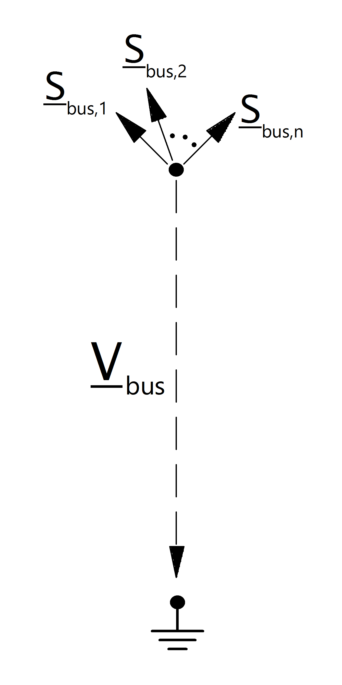

=============
Bus
=============

.. seealso::
    :ref:`Unit Systems and Conventions <conventions>`

Create Function
=====================

.. _create_bus:

.. autofunction:: pandapower.create_bus

Input Parameters
=========================

*net.bus*

.. tabularcolumns:: |p{0.12\linewidth}|p{0.10\linewidth}|p{0.25\linewidth}|p{0.30\linewidth}|
.. csv-table:: 
   :file: bus_par.csv
   :delim: ;
   :widths: 10, 10, 25, 40

.. |br| raw:: html

    
   
\*necessary for executing a power flow calculation |br| \*\*optimal power flow parameter

.. note:: Bus voltage limits can not be set for slack buses and will be ignored by the optimal power flow.

*net.bus_geodata*

.. tabularcolumns:: |p{0.10\linewidth}|p{0.10\linewidth}|p{0.30\linewidth}|
.. csv-table:: 
   :file: bus_geo.csv
   :delim: ;
   :widths: 10, 10, 30
 
   
Electric Model
=================

    

Result Parameters
=========================

*net.res_bus*

.. tabularcolumns:: |p{0.10\linewidth}|p{0.10\linewidth}|p{0.40\linewidth}|
.. csv-table:: 
   :file: bus_res.csv
   :delim: ;
   :widths: 10, 10, 40
    
The power flow bus results are defined as:

.. math::
   :nowrap:
   
   \begin{align*}
    vm\_pu &= \lvert \underline{V}_{bus} \rvert \\
    va\_degree &= \angle \underline{V}_{bus} \\
    p\_mw &= Re(\sum_{n=1}^N  \underline{S}_{bus, n}) \\
    q\_mvar &= Im(\sum_{n=1}^N  \underline{S}_{bus, n}) 
   \end{align*}

*net.res_bus_3ph*

.. tabularcolumns:: |p{0.10\linewidth}|p{0.10\linewidth}|p{0.40\linewidth}|
.. csv-table:: 
   :file: bus_res_3ph.csv
   :delim: ;
   :widths: 10, 10, 40
    
The power flow bus results are defined as:

.. math::
   :nowrap:
   
	\begin{align*}
    vm\_pu_{phase} &= \lvert \underline{V_{phase}}_{bus} \rvert \\
    va\_degree_{phase} &= \angle \underline{V_{phase}}_{bus} \\
    p\_mw_{phase} &= Re(\sum_{n=1}^N  \underline{S_{phase}}_{bus, n}) \\
    q\_mvar_{phase} &= Im(\sum_{n=1}^N  \underline{S_{phase}}_{bus, n}) 
   \end{align*}

*net.res_bus_est*

The state estimation results are put into *net.res_bus_est* with the same definition as in *net.res_bus*.

.. tabularcolumns:: |p{0.10\linewidth}|p{0.10\linewidth}|p{0.40\linewidth}|
.. csv-table:: 
   :file: bus_res.csv
   :delim: ;
   :widths: 10, 10, 40
    

.. note::

   Bus power values are given in the consumer system. Therefore a bus with positive p_mw value consumes power while a bus with negative active power supplies power.

*net.res_bus_sc*

The short-circuit (SC) results are put into *net.res_bus_sc* with following definitions:

.. tabularcolumns:: |p{0.10\linewidth}|p{0.10\linewidth}|p{0.40\linewidth}|
.. csv-table:: 
   :file: bus_res_sc.csv
   :delim: ;
   :widths: 10, 10, 40