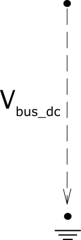

=============
DC Bus
=============

.. seealso::
    :ref:`Unit Systems and Conventions <conventions>`

Create Function
=====================

.. _create_bus_dc:

.. autofunction:: pandapower.create_bus_dc

Input Parameters
=========================

*net.bus_dc*

.. tabularcolumns:: |p{0.12\linewidth}|p{0.10\linewidth}|p{0.25\linewidth}|p{0.30\linewidth}|
.. csv-table:: 
   :file: bus_dc_par.csv
   :delim: ;
   :widths: 10, 10, 25, 40

.. |br| raw:: html

    
   
\*necessary for executing a power flow calculation

.. note:: Bus voltage limits can not be set for slack buses and will be ignored by the optimal power flow.

*net.bus_dc_geodata*

.. tabularcolumns:: |p{0.10\linewidth}|p{0.10\linewidth}|p{0.30\linewidth}|
.. csv-table:: 
   :file: bus_dc_geo.csv
   :delim: ;
   :widths: 10, 10, 30
 
   
Electric Model
=================

    

Result Parameters
=========================

*net.res_bus_dc*

.. tabularcolumns:: |p{0.10\linewidth}|p{0.10\linewidth}|p{0.40\linewidth}|
.. csv-table:: 
   :file: bus_dc_res.csv
   :delim: ;
   :widths: 10, 10, 40
    
The power flow bus results are defined as:

.. math::
   :nowrap:
   
   \begin{align*}
    vm\_pu &= \lvert \underline{V}_{bus} \rvert \\
    p\_mw &= Re(\sum_{n=1}^N  \underline{S}_{bus, n}) \\
   \end{align*}
