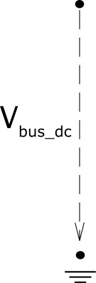

=============
Bus DC
=============

.. seealso::
    :ref:`Unit Systems and Conventions <conventions>`

Create Function
=====================

.. _create_bus_dc:

.. autofunction:: pandapower.create.create_bus_dc
.. autofunction:: pandapower.create.create_buses_dc

Input Parameters
=========================

*net.bus_dc*

.. csv-table::
    :file: table_structures/bus_dc.csv
    :header-rows: 1
    :delim: ,

.. |br| raw:: html

    
   
\*necessary for executing a power flow calculation

.. note:: Bus voltage limits can not be set for slack buses and will be ignored by the optimal power flow.
 
   
Electric Model
=================

    

Result Parameters
=========================

*net.res_bus_dc*

.. csv-table::
    :file: table_structures/res_bus_dc.csv
    :header-rows: 1
    :delim: ,
    
The power flow bus results are defined as:

.. math::
   :nowrap:
   
   \begin{align*}
    vm\_pu &= \lvert \underline{V}_{bus} \rvert \\
    p\_mw &= Re(\sum_{n=1}^N  \underline{S}_{bus, n}) \\
   \end{align*}
