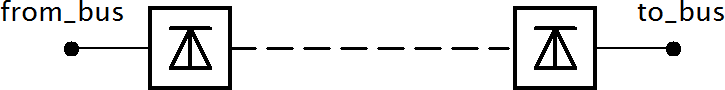
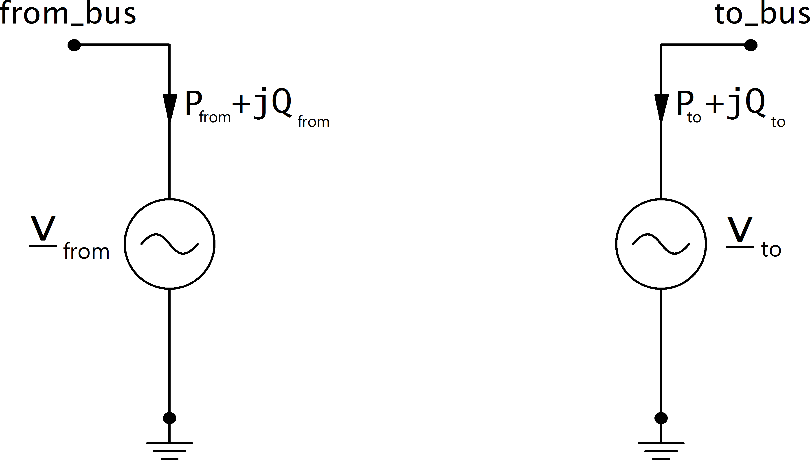

.. _dcline:

====================
HV DC Link / DC Line
====================

.. seealso::
    :ref:`Unit Systems and Conventions <conventions>`

Create Function
=====================

.. autofunction:: pandapower.create_dcline

Table Structure
=====================

*net.dcline*

.. csv-table::
    :file: table_structures/dcline.csv
    :header-rows: 1
    :delim: ,

.. note::
    DC line is only able to model one-directional loadflow for now, which is why p_mw / max_p_mw have to be > 0.
   
Electric Model
=================

A DC line is modelled as two generators in the loadflow:

    
The active power at the from side is defined by the parameters in the dcline table. The active power at the to side is equal to the active power on the from side minus the losses of the DC line.
If the active power is negative, the values are swapped: Meaning the current is flowing backwards from to_bus to from_bus. Also the active power limits are inverted, not the reactive power limits.

.. math::
   :nowrap:
   
   \begin{align*}
    P_{from} &= p\_mw \\
    P_{to} &= -p\_mw \cdot (1 - \frac{loss\_percent}{100}) - loss\_mw
   \end{align*}

The voltage control with reactive power works just as described for the generator model. Maximum and Minimum reactive power limits are considered in the OPF, and in the PF if it is run with enforce_q_lims=True.
   
Result Table
==========================
*net.res_dcline*

.. csv-table::
    :file: table_structures/res_dcline.csv
    :header-rows: 1
    :delim: ,
   
.. math::
   :nowrap:
   
   \begin{align*}
    p\_from\_mw &= P_{from} \\
    p\_to\_mw &= P_{to} \\
    pl\_mw &= p\_from\_mw + p\_to\_mw \\
    q\_from\_mvar &= Q_{from} \\
    q\_to\_mvar &= Q_{to} \\
    va\_from\_degree &= \angle \underline{v}_{from} \\
    va\_to\_degree &= \angle \underline{v}_{to} \\
    vm\_from\_degree &= |\underline{v}_{from}| \\    
    vm\_to\_degree &= |\underline{v}_{to}| \\
   \end{align*}
