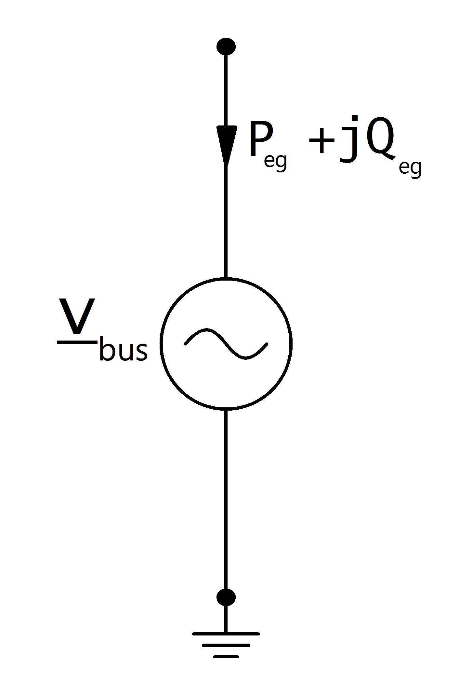
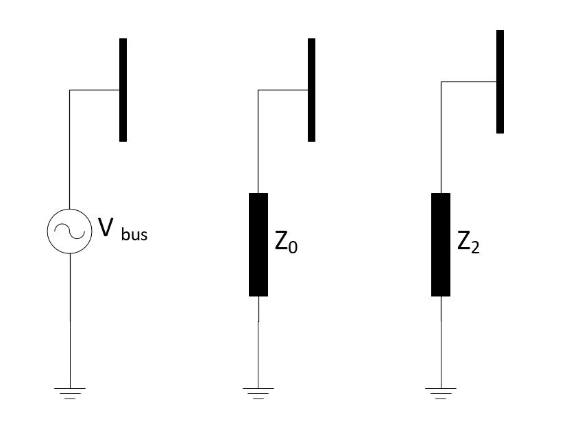

=============
External Grid
=============

.. note::

   Power values of external grids are given in the generator system, therefore p_mw is negative if the external grid is absorbing power and positive if it is supplying/generating power.

.. seealso::
    :ref:`Unit Systems and Conventions <conventions>`
   
Create Function
=====================

.. autofunction:: pandapower.create.create_ext_grid

Input Parameters
=============================

*net.ext_grid*

.. tabularcolumns:: |p{0.15\linewidth}|p{0.10\linewidth}|p{0.15\linewidth}|p{0.40\linewidth}|
.. csv-table:: 
   :file: ext_grid_par.csv
   :delim: ;
   :widths: 15, 10, 15, 40

.. |br| raw:: html

    
   
\*necessary for executing a power flow calculation |br| \*\*optimal power flow parameter |br| \*\*\*short-circuit calculation parameter |br| \*\*\*\*Single phase short circuit/Three Phase load flow calculation parameters
   
Electric Model
=================
** Balanced Load Flow**
The external grid is modelled as a voltage source in the power flow calculation, which means the node the grid is connected to is treated as a slack node:

with:
    
.. math::
   :nowrap:
   
   \begin{align*}
    \underline{v}_{bus} &= vm\_pu \cdot e^{j \cdot \theta} \\
   \theta &= shift\_degree \cdot \frac{\pi}{180}
   \end{align*}

** Unbalanced Load Flow / Single phase short ciruit **

The external grid is modelled as a voltage source for positive sequence model, which means the node the grid is connected to is treated as a slack node.
For zero sequence and negative sequence external grid impedance is calculated:

.. math::
   :nowrap:
   
   \begin{align*}
    \underline{v}_{1} &= vm\_pu \cdot e^{j \cdot \theta} \\
   \theta &= shift\_degree \cdot \frac{\pi}{180}
   \end{align*}
   
   \begin{align*}
    \underline{Z}_{0} &= c \cdot \frac{(vm \cdot e^{j \cdot \theta})^2}{S_{sc_mva}} \\
   \theta &= shift\_degree \cdot \frac{\pi}{180}
   \end{align*}
   
   \begin{align*}
    \underline{v}_{bus} &= vm\_pu \cdot e^{j \cdot \theta} \\
   \theta &= shift\_degree \cdot \frac{\pi}{180}
   \end{align*}
   

Result Parameters
==========================    
*net.res_ext_grid*

.. tabularcolumns:: |p{0.10\linewidth}|p{0.1\linewidth}|p{0.50\linewidth}|
.. csv-table:: 
   :file: ext_grid_res.csv
   :delim: ;
   :widths: 10, 10, 50

Active and reactive power feed-in / consumption at the slack node is a result of the power flow:
   
.. math::
   :nowrap:
   
   \begin{align*}
    p\_mw &= P_{eg} \\
    q\_mvar &= Q_{eg}
    \end{align*}

*net.res_ext_grid_3ph*

.. tabularcolumns:: |p{0.10\linewidth}|p{0.1\linewidth}|p{0.50\linewidth}|
.. csv-table:: 
   :file: ext_grid_res_3ph.csv
   :delim: ;
   :widths: 10, 10, 50

Active and reactive power feed-in / consumption at the slack node is a result of the power flow:
   
.. math::
   :nowrap:
   
   \begin{align*}
    p\_mw_{phase} &= P_{eg_{phase}} \\
    q\_mvar_{phase} &= Q_{eg_{phase}}
    \end{align*}
