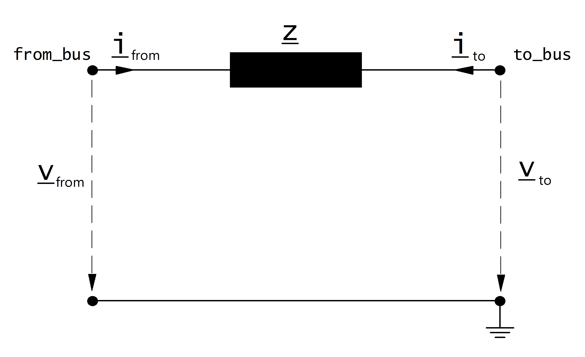

=============
Impedance
=============

.. seealso::
    :ref:`Unit Systems and Conventions <conventions>`

Create Function
=====================

.. autofunction:: pandapower.create_impedance

Input Parameters
=====================

*net.impedance*

.. tabularcolumns:: |p{0.10\linewidth}|p{0.10\linewidth}|p{0.15\linewidth}|p{0.4\linewidth}|
.. csv-table:: 
   :file: impedance_par.csv
   :delim: ;
   :widths: 10, 10, 15, 40

\*necessary for executing a power flow calculation.

.. _impedance_model:

Electric Model
=================

The impedance is modelled as a longitudinal per unit impedance with :math:`\underline{z}_{ft} \neq \underline{z}_{tf}` :

The per unit values given in the parameter table are assumed to be relative to the rated voltage of from and to bus as well as to the apparent power given in the table.
The per unit values are therefore transformed into the network per unit system:

.. math::
   :nowrap:

   \begin{align*}
    \underline{z}_{ft} &= (rft\_pu + j \cdot xft\_pu) \cdot \frac{S_{N}}{sn\_mva} \\
    \underline{z}_{tf} &= (rft\_pu + j \cdot xtf\_pu) \cdot \frac{S_{N}}{sn\_mva} \\
    \end{align*}

where :math:`S_{N}` is the reference power of the per unit system (see :ref:`Unit Systems and Conventions<conventions>`). 

The asymetric impedance results in an asymetric nodal point admittance matrix:

.. math::
   :nowrap:
   
    \begin{bmatrix} Y_{00} & \dots & \dots  & Y_{nn} \\
    \vdots & \ddots & \underline{y}_{ft} & \vdots \\
    \vdots &  \underline{y}_{tf} & \ddots & \vdots \\
    \underline{Y}_{n0} & \dots & \dots & \underline{y}_{nn}\\
    \end{bmatrix}

Result Parameters
==========================
*net.res_impedance*

.. tabularcolumns:: |p{0.10\linewidth}|p{0.1\linewidth}|p{0.55\linewidth}|
.. csv-table:: 
   :file: impedance_res.csv
   :delim: ;
   :widths: 10, 10, 55

.. math::
   :nowrap:
   
   \begin{align*}
    i\_from\_ka &= i_{from}\\
    i\_to\_ka &= i_{to}\\
    p\_from\_mw &= Re(\underline{v}_{from} \cdot \underline{i}^*_{from}) \\    
    q\_from\_mvar &= Im(\underline{v}_{from} \cdot \underline{i}^*_{from}) \\
    p\_to\_mw &= Re(\underline{v}_{to} \cdot \underline{i}^*_{to}) \\
    q\_to\_mvar &= Im(\underline{v}_{to} \cdot \underline{i}^*_{to}) \\
	pl\_mw &= p\_from\_mw + p\_to\_mw \\
	ql\_mvar &= q\_from\_mvar + q\_to\_mvar \\
    \end{align*}