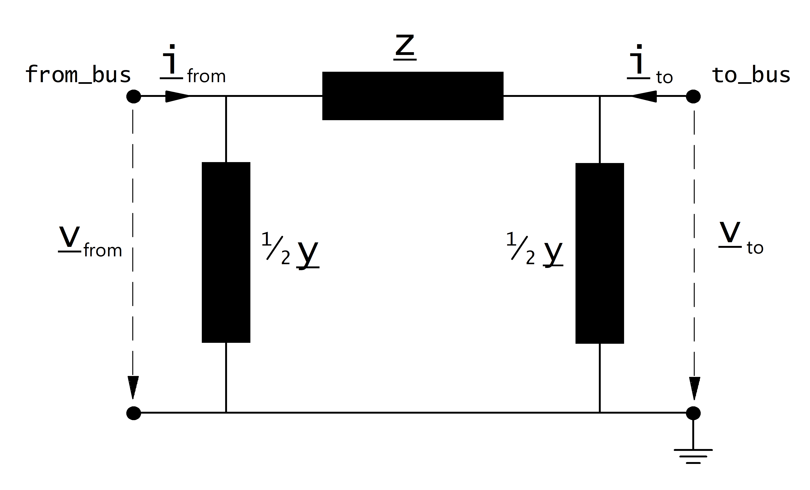
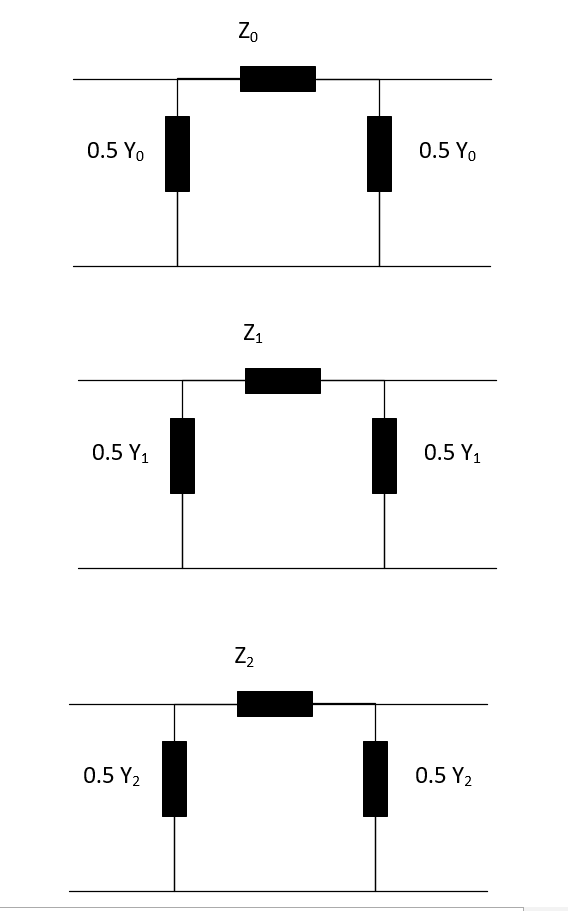

=============
Line
=============

.. |br| raw:: html

     
    
.. seealso::

    :ref:`Unit Systems and Conventions <conventions>` |br|
    :ref:`Standard Type Libraries <std_types>`
    
Create Function
=====================

.. _create_line:

Lines can be either created from the standard type library (create_line) or with custom values (create_line_from_parameters).

.. note::

	Lines for 3 phase load flow uses zero sequence parameters which can be provided through a custom standard type using **pandapower.create_std_type()**
	and **pandapower.add_zero_impedance_parameters()**
	
	**Zero sequence parameters** (Added through std_type For Three phase load flow) :

        -**r0_ohm_per_km** (float) - zero sequence line resistance in ohm per km

        -**x0_ohm_per_km** (float) - zero sequence line reactance in ohm per km

        -**c0_nf_per_km** (float)  - zero sequence line capacitance in nano Farad per km
.. autofunction:: pandapower.create_line

.. autofunction:: pandapower.create_line_from_parameters

Input Parameters
=============================

*net.line*

.. tabularcolumns:: |p{0.15\linewidth}|p{0.10\linewidth}|p{0.25\linewidth}|p{0.40\linewidth}|
.. csv-table:: 
   :file: line_par.csv
   :delim: ;
   :widths: 15, 10, 25, 40
  
\*necessary for executing a balanced power flow calculation |br| \*\*optimal power flow parameter |br| \*\*\*short-circuit calculation parameter |br| \*\*\*\*
necessary for executing a three phase power flow  / single phase short circuit 
.. note::

    Defining a line with length zero leads to a division by zero in the power flow and is therefore not allowed. Lines with a very low impedance might lead to convergence problems in the power flow
    for the same reason. If you want to directly connect two buses, please use the switch element instead of a line with a small impedance!

*net.line_geodata*

.. tabularcolumns:: |l|l|l|
.. csv-table:: 
   :file: line_geo.csv
   :delim: ;
   :widths: 10, 10, 55

   
Electric Model
=================

Lines are modelled with the :math:`\pi`-equivalent circuit:

Three phase line model 

    
The elements in the equivalent circuit are calculated from the parameters in the net.line dataframe as:

.. math::
   :nowrap:

   \begin{align*}
    \underline{Z_{1 or 2}} &= (r\_ohm\_per\_km + j \cdot x\_ohm\_per\_km) \cdot \frac{length\_km}{parallel}  \\
    \underline{Y_{1 or 2}}&= (g\_us\_per\_km \cdot 1 \cdot 10^-6 + j \cdot 2 \pi f \cdot c\_nf\_per\_km \cdot 1 \cdot 10^-9) \cdot length\_km \cdot parallel\\
	\underline{Z_{0}} &= (r0\_ohm\_per\_km + j \cdot x0\_ohm\_per\_km) \cdot \frac{length\_km}{parallel}  \\
    \underline{Y_{0}} &= (g\_us\_per\_km \cdot 1 \cdot 10^-6 + j \cdot 2 \pi f \cdot c0\_nf\_per\_km \cdot 1 \cdot 10^-9) \cdot length\_km \cdot parallel
   \end{align*}
    
The power system frequency :math:`f` is defined when creating an empty network, the default value is :math:`f = 50 Hz`.

.. note::

	For three phase load flow, three decoupled sequence networks ( zero , positive and negtive) are considered.
	
	**Positive and Negative sequence impedances** are given by r_ohm_per_km, x_ohm_per_km, and c_nf_per_km
	
	**Zero sequence impedances** are given by r0_ohm_per_km, x0_ohm_per_km, and c0_nf_per_km
	

The parameters are then transformed in the per unit system:

.. math::
   :nowrap:

   \begin{align*}
    Z_{N} &= \frac{V_{N}^2}{S_{N}} \\
    \underline{z} &= \frac{\underline{Z}}{Z_{N}} \\
    \underline{y} &= \underline{Y} \cdot Z_{N} \\
    \end{align*}

Where the reference voltage :math:`V_{N}` is the nominal voltage at the from bus and the rated apparent power :math:`S_{N}` is defined system wide in the net object (see :ref:`Unit Systems and Conventions<conventions>`).

.. note::
    pandapower assumes that nominal voltage of from bus and to bus are equal, which means pandapower does not support lines that connect different voltage levels.
    If you want to connect different voltage levels, either use a transformer or an impedance element.
    
Result Parameters
==========================
   
*net.res_line*

.. tabularcolumns:: |p{0.15\linewidth}|p{0.10\linewidth}|p{0.55\linewidth}|
.. csv-table:: 
   :file: line_res.csv
   :delim: ;
   :widths: 15, 10, 55
   
The power flow results in the net.res_line table are defined as:

.. math::
   :nowrap:
   
   \begin{align*}
    p\_from\_mw &= Re(\underline{v}_{from} \cdot \underline{i}^*_{from}) \\    
    q\_from\_mvar &= Im(\underline{v}_{from} \cdot \underline{i}^*_{from}) \\
    p\_to\_mw &= Re(\underline{v}_{to} \cdot \underline{i}^*_{to}) \\
    q\_to\_mvar &= Im(\underline{v}_{to} \cdot \underline{i}^*_{to}) \\
	pl\_mw &= p\_from\_mw + p\_to\_mw \\
	ql\_mvar &= q\_from\_mvar + q\_to\_mvar \\
    i\_from\_ka &= i_{from} \\
    i\_to\_ka &= i_{to} \\
    i\_ka &= max(i_{from}, i_{to}) \\
    loading\_percent &= \frac{i\_ka}{imax\_ka \cdot df \cdot parallel} \cdot 100 
    \end{align*}

*net.res_line_3ph*

.. tabularcolumns:: |p{0.15\linewidth}|p{0.10\linewidth}|p{0.55\linewidth}|    
.. csv-table:: 
   :file: line_res_3ph.csv
   :delim: ;
   :widths: 15, 10, 55
   
The power flow results in the net.res_line_3ph table are defined as:

.. math::
   :nowrap:
   
   \begin{align*}
    p\_from\_mw_{phase} &= Re(\underline{v_{phase}}_{from} \cdot \underline{i_{phase}}^*_{from}) \\    
    q\_from\_mvar_{phase} &= Im(\underline{v_{phase}}_{from} \cdot \underline{i_{phase}}^*_{from}) \\
    p\_to\_mw_{phase} &= Re(\underline{v_{phase}}_{to} \cdot \underline{i_{phase}}^*_{to}) \\
    q\_to\_mvar_{phase} &= Im(\underline{v_{phase}}_{to} \cdot \underline{i_{phase}}^*_{to}) \\
	pl\_mw_{phase} &= p\_from\_mw_{phase} + p\_to\_mw_{phase} \\
	ql\_mvar_{phase} &= q\_from\_mvar_{phase} + q\_to\_mvar_{phase} \\
    i\_from\_ka_{phase} &= i_{from_{phase}} \\
    i\_to\_ka_{phase} &= i_{to_{phase}} \\
    i\_ka &= max(i_{from}, i_{to}) \\
    i\_from\_ka_{neutral} &= |i_{from_{phaseA}}| + |i_{from_{phaseB}}| + |i_{from_{phaseC}}|\\
    i\_to\_ka_{neutral} &= |i_{to_{phaseA}}| + |i_{to_{phaseB}}| + |i_{to_{phaseC}}| \\
    loading\_percent &= \frac{i\_ka}{imax\_ka \cdot df \cdot parallel} \cdot 100 
    \end{align*}

*net.res_line_est*

The state estimation results are put into *net.res_line_est* with the same definition as in *net.res_line*.

.. tabularcolumns:: |p{0.15\linewidth}|p{0.10\linewidth}|p{0.55\linewidth}|
.. csv-table:: 
   :file: line_res.csv
   :delim: ;
   :widths: 15, 10, 55