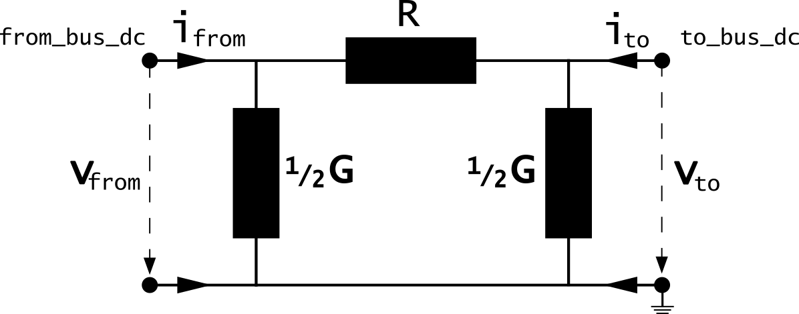

=============
Line_dc
=============

.. |br| raw:: html

     
    
.. seealso::

    :ref:`Unit Systems and Conventions <conventions>` |br|
    :ref:`Standard Type Libraries <std_types>`
    
Create Function
=====================

.. _create_line_dc:

DC lines can be either created from the standard type library (create_line_dc) or with custom values (create_line_dc_from_parameters).

.. autofunction:: pandapower.create_line_dc

.. autofunction:: pandapower.create_line_dc_from_parameters

Input Parameters
=============================

*net.line_dc*

.. tabularcolumns:: |p{0.15\linewidth}|p{0.10\linewidth}|p{0.25\linewidth}|p{0.40\linewidth}|
.. csv-table:: 
   :file: line_dc_par.csv
   :delim: ;
   :widths: 15, 10, 25, 40
  
\*necessary for executing a balanced power flow calculation

.. note::

    Defining a dc line with length zero leads to a division by zero in the power flow and is therefore not allowed. DC lines with a very low impedance might lead to convergence problems in the power flow
    for the same reason. If you want to directly connect two dc buses, please use the switch_dc element instead of a dc line with a small impedance!

*net.line_dc_geodata*

.. tabularcolumns:: |l|l|l|
.. csv-table:: 
   :file: line_dc_geo.csv
   :delim: ;
   :widths: 10, 10, 55

   
Electric Model
=================

DC lines are modelled with the :math:`\pi`-equivalent circuit:

The elements in the equivalent circuit are calculated from the parameters in the net.line_dc dataframe as:

.. math::
   :nowrap:

   \begin{align*}
    \{R} &= (r\_ohm\_per\_km) \cdot \frac{length\_km}{parallel}  \\
    \{G} &= g\_us\_per\_km \cdot 10^-6 \cdot length\_km \cdot parallel\\
    \end{align*}

The parameters are then transformed in the per unit system:

.. math::
   :nowrap:

   \begin{align*}
    R_N &= \frac{V_N^2}{S_N} \\
    r &= \frac{R}{R_N} \\
    g &= G \cdot R_N \\
    \end{align*}

Where the reference voltage :math:`V_{N}` is the nominal voltage at the from bus and the rated apparent power :math:`S_{N}` is defined system wide in the net object (see :ref:`Unit Systems and Conventions<conventions>`).

.. note::
    pandapower assumes that nominal voltage of from bus and to bus are equal, which means pandapower does not support lines that connect different voltage levels.
    If you want to connect different voltage levels, either use a transformer or an impedance element.
    
Result Parameters
==========================
   
*net.res_line_dc*

.. tabularcolumns:: |p{0.15\linewidth}|p{0.10\linewidth}|p{0.55\linewidth}|
.. csv-table:: 
   :file: line_dc_res.csv
   :delim: ;
   :widths: 15, 10, 55
   
The power flow results in the net.res_line_dc table are defined as:

.. math::
   :nowrap:
   
   \begin{align*}
    p\_from\_mw &= v_{from} \cdot i_{from} \\
    p\_to\_mw &= v_{to} \cdot i_{to} \\
	pl\_mw &= p\_from\_mw + p\_to\_mw \\
    i\_from\_ka &= i_{from} \\
    i\_to\_ka &= i_{to} \\
    i\_ka &= max(i_{from}, i_{to}) \\
    loading\_percent &= \frac{i\_ka}{imax\_ka \cdot df \cdot parallel} \cdot 100 
    \end{align*}

