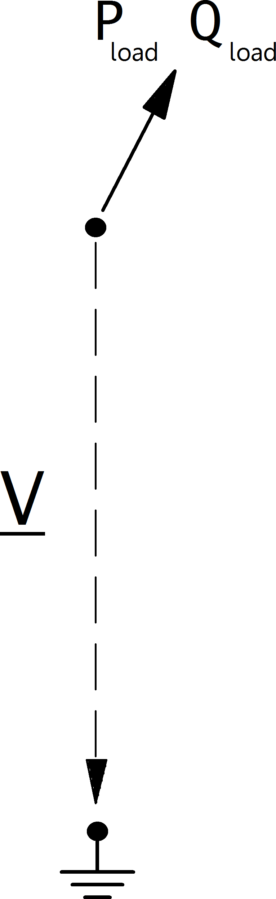

=============
Load
=============

.. note::

   Loads should always have a positive p_mw value, since all power values are given in the consumer system. If you want to model constant generation, use a Static Generator (sgen element) instead of a negative load.

.. seealso::
    :ref:`Unit Systems and Conventions <conventions>`

Create Function
=====================

.. autofunction:: pandapower.create_load

.. autofunction:: pandapower.create_load_from_cosphi

Input Parameters
=====================

*net.load*

.. tabularcolumns:: |p{0.10\linewidth}|p{0.10\linewidth}|p{0.25\linewidth}|p{0.40\linewidth}|

.. csv-table::
   :file: load_par.csv
   :delim: ;
   :widths: 10, 10, 25, 40

\*necessary for executing a power flow calculation.

.. note::
    
    The apparent power value sn_mva is provided as additional information for usage in controller or other applications based on panadapower. It is not considered in the power flow!  

Electric Model
=================

Loads are modelled as PQ-buses in the power flow calculation, with an option to use the so-called ZIP load model, where a load is represented as a composition of constant power (P), constant current (I) and constant impedance (Z):

What part of the load is considered constant with constant power, constant current or constant impedance is defined as follows:
  
.. math::
   :nowrap:
   
    \begin{align*}
    z_{const} =& const\_z\_percent / 100 \\
    i_{const} =& const\_i\_percent / 100 \\
    p_{const} =& (100 - const\_z\_percent - const\_i\_percent) / 100
    \end{align*}
    
The load power values are then defines as:

.. math::
   :nowrap:
   
   \begin{align*}
    P_{load} =&  p\_mw \cdot scaling \cdot (p_{const} + z_{const} \cdot V^2 + i_{const} \cdot V ) \\
    Q_{load} =&  q\_mvar \cdot scaling \cdot (p_{const} + z_{const} \cdot V^2 + i_{const} \cdot V)
    \end{align*}

Result Parameters
==========================    
*net.res_load*

.. tabularcolumns:: |p{0.10\linewidth}|p{0.10\linewidth}|p{0.45\linewidth}|
.. csv-table:: 
   :file: load_res.csv
   :delim: ;
   :widths: 10, 10, 45
   
The power values in the net.res_load table are equivalent to :math:`P_{load}` and :math:`Q_{load}`.

