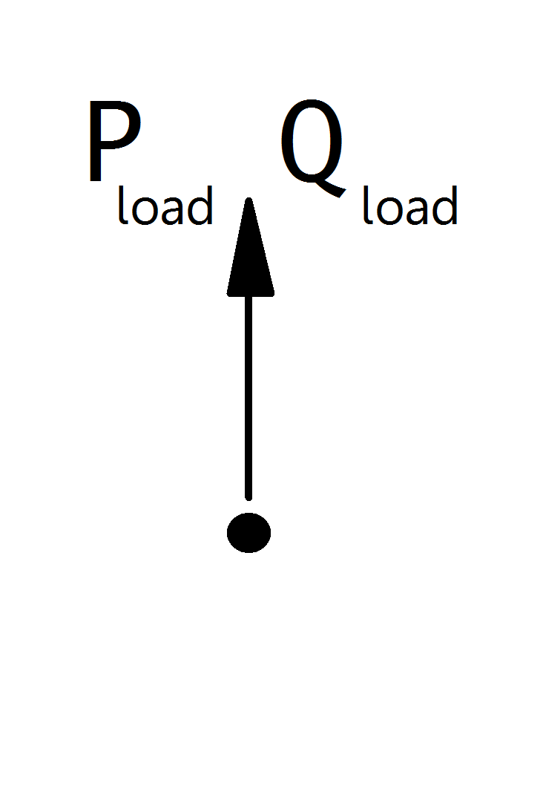

==================
Static Generator
==================

.. note::

   Static generators should always have a positive p_mw value, since all power values are given in the generator convention. If you want to model constant power consumption, it is recommended to use a load element instead of a static generator with negative active power value.
   If you want to model a voltage controlled generator, use the generator element.

.. seealso::
    :ref:`Unit Systems and Conventions <conventions>`

Create Function
=====================

.. autofunction:: pandapower.create_sgen

.. autofunction:: pandapower.create_sgen_from_cosphi

Input Parameters
=====================

*net.sgen*

.. tabularcolumns:: |p{0.10\linewidth}|p{0.10\linewidth}|p{0.25\linewidth}|p{0.40\linewidth}|
.. csv-table:: 
   :file: sgen_par.csv
   :delim: ;
   :widths: 10, 10, 25, 40

.. |br| raw:: html

    
   
\*necessary for executing a power flow calculation |br| \*\*optimal power flow parameter |br| \*\*\*short-circuit calculation parameter
|br| \^relevant for power flow calculation when `enforce_p_lims` optional parameter is set to True |br| \^\^relevant for power flow calculation when `enforce_q_lims` optional parameter is set to True

Static Generator Reactive Power Capability Curve Characteristics
=================================================================

The static generator reactive power capability curve characteristics provide a reference framework for determining the
reactive power limits (Qmin and Qmax) of static generators based on their active power output.
The reactive power capability curve data can be imported into pandapower in a tabular format, populating
net.q_capability_curve_table. The characteristics can either be automatically generated via the CIM CGMES to
pandapower converter or the PowerFactory to pandapower converter, or they can be created by the user using the
pandapower.control.util.create_q_capability_characteristics_object function, provided that the
q_capability_curve_table is previously defined in the network case. Q capability curve characteristic objects are then
generated from net.q_capability_curve_table, populating net.q_capability_characteristic.

If the variable `reactive_capability_curve` in net.sgen is set to True, it indicates that pairs of P vs Qmin/Qmax values
and the corresponding characteristic are defined in net.q_capability_curve_table and net.q_capability_characteristic
respectively. This overrides the default reactive power limits of the static generator when i) a power flow is executed
and the `enforce_q_lims` option is enabled; or ii) an optimal power flow is executed for static generators that have
their `controllable` flag set to True.
The variable `id_q_capability_characteristic` in net.sgen establishes a direct reference to the `id_q_capability_curve`
column in both net.q_capability_curve_table and net.q_capability_characteristic, thereby associating each static
generator with its corresponding capability curve.

Below is an example of a q_capability_curve_table populated for two sample static generators.

.. tabularcolumns:: |p{0.10\linewidth}|p{0.10\linewidth}|p{0.55\linewidth}|p{0.15\linewidth}|p{0.55\linewidth}
.. csv-table::
   :file: sgen_q_char_table.csv
   :delim: ,
   :widths: 10, 10, 55, 55, 55

The table below illustrates an example of a q_capability_characteristic table populated for two static generators.

.. tabularcolumns:: |p{0.10\linewidth}|p{0.10\linewidth}|p{0.55\linewidth}|p{0.55\linewidth}
.. csv-table::
   :file: gen_q_char_table_object.csv
   :delim: ,

.. note::
    - reactive_capability_curve has to be set to True, and id_q_capability_characteristic and curve_style variables
      need to be populated in order to consider the reactive power limits of the corresponding characteristic.
    - Each static generator supports only a single reactive_capability_curve.
    - In this version, only two types of generator reactive power capability characteristics are supported:
      1. constantYValue: The reactive power values are assumed constant until the next curve point and prior to the first curve point.
      2. straightLineYValues: The reactive power values are assumed to be a straight line between values.
    - Linear interpolation is employed to determine Qmin and Qmax based on the given active power dispatch for the above two curve types.

The function pandapower.control.util.q_capability_curve_table_diagnostic is available to perform sanity checks
on the generator reactive power capability curve table.

Electric Model
=================

Static Generators are modelled as PQ-buses in the power flow calculation:

    
The PQ-Values are calculated from the parameter table values as:

.. math::
   :nowrap:
   
   \begin{align*}
    P_{sgen} &= p\_mw \cdot scaling \\
    Q_{sgen} &= q\_mvar \cdot scaling \\
    \end{align*}

.. note::
    
    The apparent power value sn_mva is provided as additional information for usage in controller or other applications based on pandapower. It is not considered in the power flow!

Result Parameters
==========================
*net.res_sgen*

.. tabularcolumns:: |p{0.10\linewidth}|p{0.10\linewidth}|p{0.50\linewidth}|
.. csv-table:: 
   :file: sgen_res.csv
   :delim: ;
   :widths: 10, 10, 50

The power values in the net.res_sgen table are equivalent to :math:`P_{sgen}` and :math:`Q_{sgen}`.