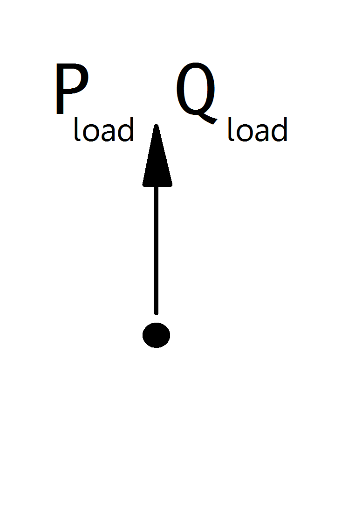

.. _source_dc:

==================
Source DC
==================

.. note::

   Sources should always have a positive p_mw value, since all power values are given in the generator convention. If you want to model constant power consumption, it is recommended to use a load element instead of a source with negative active power value.

.. seealso::
    :ref:`Unit Systems and Conventions <conventions>`

Create Function
=====================

.. autofunction:: pandapower.create.create_source_dc

Table Structure
=====================

*net.source_dc*

.. csv-table::
    :file: table_structures/source_dc.csv
    :header-rows: 1
    :delim: ,

Electric Model
=================

DC sources are modelled as P-buses in the power flow calculation:

    
The P-Values are calculated from the parameter table values as:

.. math::
    P_{sgen} = p\_mw \cdot scaling

.. note::
    
    Other values are provided as additional information for usage in controller or other applications based on pandapower. It is not considered in the power flow!

Result Table
==========================
*net.res_source_dc*

.. csv-table::
    :file: table_structures/res_source_dc.csv
    :header-rows: 1
    :delim: ,

The power values in the net.res_source_dc table are equivalent to :math:`P_{sgen}`.
