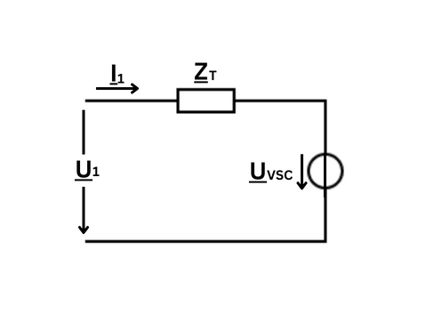

.. _ssc:

==============================================
Static Synchronous Compensator (SSC)
==============================================

We implement the FACTS devices based on the following source:

    A. Panosyan, "Modeling of advanced power transmission system controllers",
    Ph.D. dissertation, Gottfried Wilhelm Leibniz Universität Hannover, 2010.

The Static Synchronous Compensator (SSC), also known as STATCOM, is a shunt connected Flexible AC Transmission System
(FACTS) controller. It connects an AC system to a Voltage Source Converter (VSC) through a coupling transformer.
The SSC is used for reactive shunt compensation. Since the VSC is not connected to a power source, there is no active
power exchange between the SSC and the AC system. Consequently, the SSC can only control the voltage magnitude of
the AC system.

.. seealso::
    :ref:`Unit Systems and Conventions <conventions>`

We demonstrate the use-case of this device in the
pandapower tutorial: `FACTS <https://github.com/e2nIEE/pandapower/blob/develop/tutorials/FACTS.ipynb>`_.

Create Function
=====================

.. autofunction:: pandapower.create.create_ssc

Input Parameters
=====================

*net.ssc*

.. tabularcolumns:: |p{0.10\linewidth}|p{0.10\linewidth}|p{0.25\linewidth}|p{0.4\linewidth}|
.. csv-table:: 
   :file: ssc_par.csv
   :delim: ;
   :widths: 10, 10, 25, 40

\*necessary for executing a power flow calculation.

   
Electric Model
=================

The SSC is a VSC-based shunt-connected FACTS controller and can thus be modeled as a single-terminal active component.
The corresponding terminal-admittance equation is given as:

.. math::
   :nowrap:
   
    \begin{align*}
    \underline{Y}_{T} (\underline{U}_{1} - \underline{U}_{VSC}) = \underline{I}_{1}
    \end{align*}

Where :math:`\underline{Y}_{T}` = 1/:math:`\underline{Z}_{T}` is the admittance of the lossless-assumed coupling transformer between
the VSC and the ac system. :math:`\underline{U}_{VSC}` stands for the VSC output Voltage.

Result Parameters
==========================
*net.res_ssc*

.. tabularcolumns:: |p{0.10\linewidth}|p{0.10\linewidth}|p{0.40\linewidth}|
.. csv-table:: 
   :file: ssc_res.csv
   :delim: ;
   :widths: 10, 10, 40
