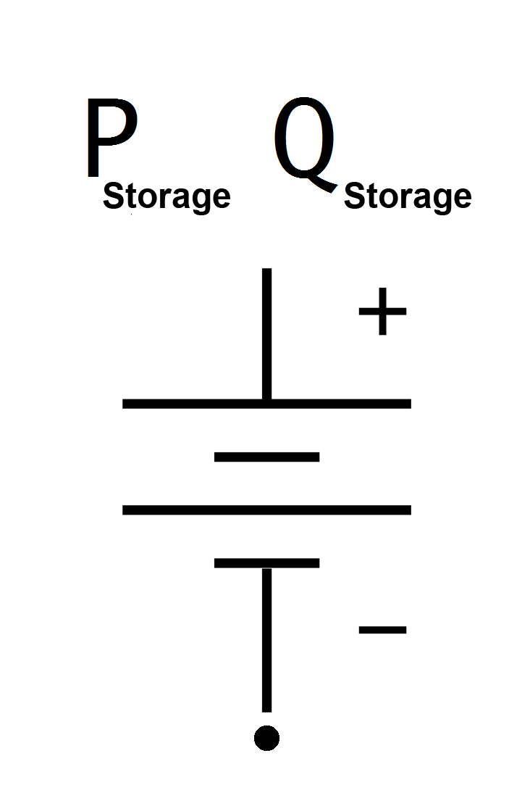

==================
Storage
==================

.. seealso::
    :ref:`Unit Systems and Conventions <conventions>`

Create Function
=====================

.. autofunction:: pandapower.create_storage

Input Parameters
=====================

*net.storage*

.. tabularcolumns:: |p{0.10\linewidth}|p{0.10\linewidth}|p{0.25\linewidth}|p{0.40\linewidth}|
.. csv-table::
   :file: storage_par.csv
   :delim: ;
   :widths: 10, 10, 25, 40

.. |br| raw:: html

    

\*necessary for executing a power flow calculation |br| \*\*optimal power flow parameter

Electric Model
=================

Storages are modelled as PQ-buses in the power flow calculation:

The PQ-Values are calculated from the parameter table values as:

.. math::
   :nowrap:

   \begin{align*}
    P_{storage} &= p\_kw \cdot scaling \\
    Q_{storage} &= q\_kvar \cdot scaling \\
    \end{align*}

.. note::

   Since all power values are given in the consumer system, negative power models charging and positive activee power models discharging.

.. note::

    The apparent power value sn_kva, state of charge soc and storage capacity max_e_kwh are provided as additional information for usage in controller or other applications based on panadapower. It is not considered in the power flow!

Result Parameters
==========================
*net.res_storage*

.. tabularcolumns:: |p{0.10\linewidth}|p{0.10\linewidth}|p{0.50\linewidth}|
.. csv-table::
   :file: storage_res.csv
   :delim: ;
   :widths: 10, 10, 50

The power values in the net.res_storage table are equivalent to :math:`P_{storage}` and :math:`Q_{storage}`.