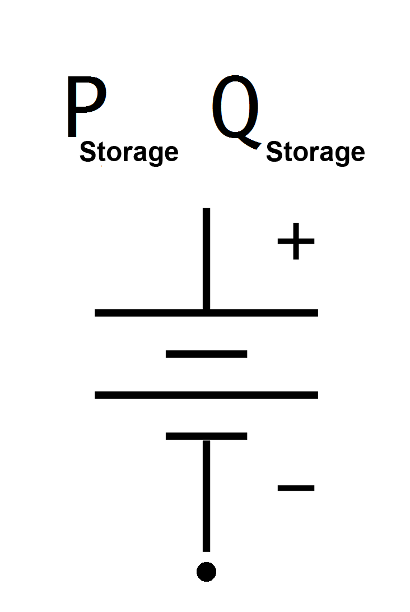

==================
Storage
==================

.. note::

   Since storage power values are given in the consumer system, positive power models charging and negative power models discharging.

.. seealso::
    :ref:`Unit Systems and Conventions <conventions>`

Create Function
=====================

.. autofunction:: pandapower.create.create_storage
.. autofunction:: pandapower.create.create_storages

Table Structure
=====================

*net.storage*

.. csv-table::
    :file: table_structures/storage.csv
    :header-rows: 1
    :delim: ,

Electric Model
=================

Storages are modelled as PQ-buses in the power flow calculation:

The PQ-Values are calculated from the parameter table values as:

.. math::
   :nowrap:

   \begin{align*}
    P_{storage} &= p\_mw \cdot scaling \\
    Q_{storage} &= q\_mvar \cdot scaling \\
    \end{align*}

.. note::

    The apparent power value sn_mva, state of charge soc and storage capacity max_e_mwh are provided as additional information for usage in controller or other applications based on pandapower. It is not considered in the power flow!

Result Table
==========================
*net.res_storage*

.. csv-table::
    :file: table_structures/res_storage.csv
    :header-rows: 1
    :delim: ,

The power values in the net.res_storage table are equivalent to :math:`P_{storage}` and :math:`Q_{storage}`.
