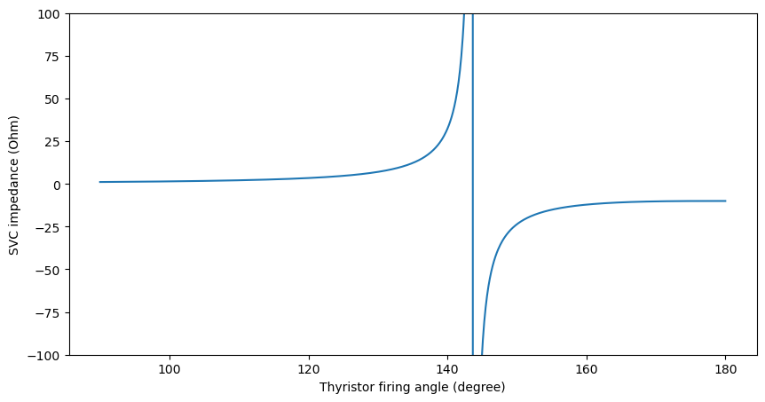
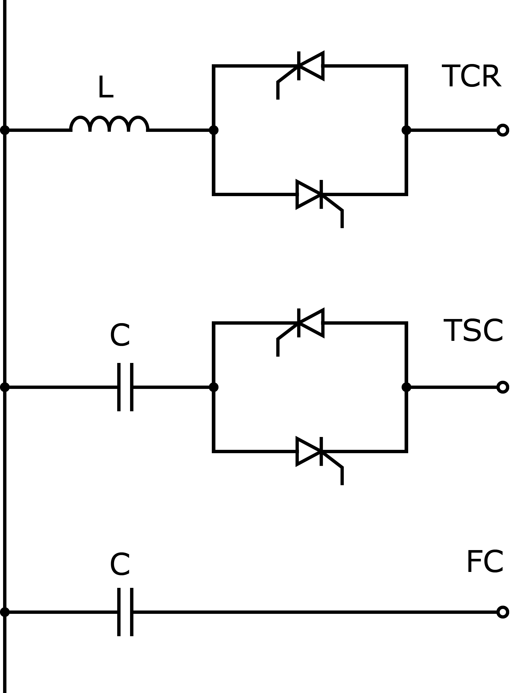

.. _svc:

==============================
Static Var Compensator (SVC)
==============================

We implement the FACTS devices based on the following source:

    A. Panosyan, "Modeling of advanced power transmission system controllers",
    Ph.D. dissertation, Gottfried Wilhelm Leibniz Universität Hannover, 2010.

The element SVC is a shunt-connected thyristor-based power electronic device. It regulates the voltage magnitude at the
connected bus by adjusting the shunt impedance value. The shunt impedance only has the reactance component
(no resistive part). The impedance can be capacitive or inductive, because the device consists of a fixed capacitor in
a parallel circuit to the reactor that is regulated by a pair of antiparallel thyristors.
The thyristor firing angle regulates the total impedance of the element.

The active range of the device is presented in the figure below:

It can be seen that the device has a resonance region
between the inductive (positive) and the capacitive (negative) impedance characteristics.
In real application, the operation of the device in the resonance region is prohibited by defining the inadmissible
range for the thyristor firing angle around the resonance point. We did not implement this in our software - this
should be considered for future work.

The device operates in the value range of the thyristor firing angle between 90° and 180°. Any results for the
thyristor firing angle outside of this range are invalid (we have not observed a converged result with values outside
of the valid range in the test cases). Even though we include the values of min_angle_degree and max_angle_degree in
the create function, they are not considered during the power flow calculation. For future work, the functionality
similar to "enforce_q_lims" should be implemented.

We demonstrate the use-case of this device in the
pandapower tutorial: `FACTS <https://github.com/e2nIEE/pandapower/blob/develop/tutorials/FACTS.ipynb>`_.

.. seealso::
    :ref:`Unit Systems and Conventions <conventions>`

Create Function
=====================

.. autofunction:: pandapower.create.create_svc

Input Parameters
=====================

*net.svc*

.. tabularcolumns:: |p{0.10\linewidth}|p{0.10\linewidth}|p{0.25\linewidth}|p{0.4\linewidth}|
.. csv-table::
   :file: svc_par.csv
   :delim: ;
   :widths: 10, 10, 25, 40

\*necessary for executing a power flow calculation.

Electric Model
=================

The shunt impedance :math:`X_{SVC}` of the SVC element is calculated according to the following equation:

.. math::
   :nowrap:

   \begin{align*}
   X_{SVC} &= \frac{\pi X_L}{2 (\pi - \alpha) + \sin{(2\alpha)} + \frac{\pi X_L}{X_{Cvar}}}
   \end{align*}

The term :math:`X_L` stands for the reactance of the reactor (x_l_ohm) and the term :math:`X_{Cvar}` stands for the
total capacitance (x_cvar_ohm). The thyristor firing angle :math:`\alpha` is the state variable that on the one hand
defines the impedance of the element, and at the same time is the result of the Newton-Raphson calculation.

The reactive power consumption of the SVC element is calculated with:

.. math::
   :nowrap:

   \begin{align*}
   Q_{SVC} = \frac{V^2}{X_{SVC}}
   \end{align*}

Where V is the complex voltage observed at the connection bus of the SVC element.
The reference values for the per unit system as defined in :ref:`Unit Systems and Conventions<conventions>`.

Result Parameters
==========================
*net.res_svc*

.. tabularcolumns:: |p{0.10\linewidth}|p{0.10\linewidth}|p{0.40\linewidth}|
.. csv-table::
   :file: svc_res.csv
   :delim: ;
   :widths: 10, 10, 40
