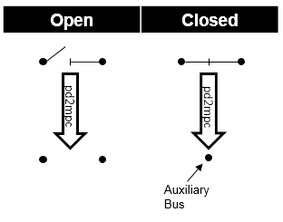
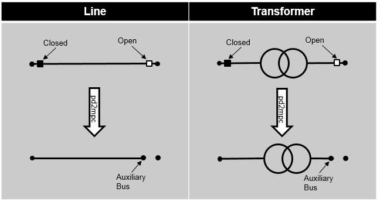

.. _switch_model:

=============
Switch
=============

Create Function
=====================

.. autofunction:: pandapower.create.create_switch

Input Parameters
=====================

*net.switch*

.. tabularcolumns:: |p{0.10\linewidth}|p{0.10\linewidth}|p{0.25\linewidth}|p{0.40\linewidth}|
.. csv-table:: 
   :file: switch_par.csv
   :delim: ;
   :widths: 10, 10, 25, 40

\*necessary for executing a power flow calculation.

   
Electric Model
=================

*Bus-Bus-Switches:*

Two buses that are connected with a closed bus-bus switches are fused internally for the power flow, open bus-bus switches are ignored:

This has the following advantages compared to modelling the switch as a small impedance:

    - there is no voltage drop over the switch (ideal switch)
    - no convergence problems due to small impedances / large admittances
    - less buses in the admittance matrix
    
*Bus-Element-Switches:*

When the power flow is calculated internally for every open bus-element switch an auxilary bus is created in the pypower case file. The pypower branch that corresponds to the element is then connected to this bus. This has the following advantages compared to modelling the switch by setting the element out of service:

    - loading current is considered
    - information about switch position is preserved
    - difference between open switch and out of service line (e.g. faulty line) can be modelled

Closed bus-element switches are ignored:

