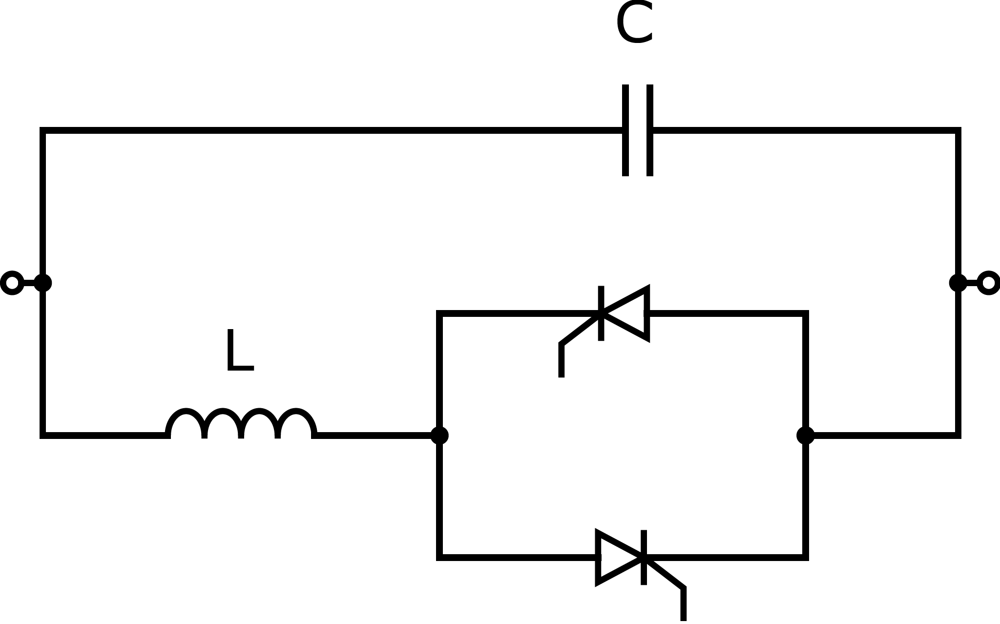

.. _tcsc:

==============================================
Thyristor-Controlled Series Capacitor (TCSC)
==============================================

We implement the FACTS devices based on the following source:

    A. Panosyan, "Modeling of advanced power transmission system controllers",
    Ph.D. dissertation, Gottfried Wilhelm Leibniz Universität Hannover, 2010.

Thyristor-Controlled Series Capacitor (TCSC) device is a series element that controles the power flowing through its
path by regulating its impedance.
The TCSC device is very similar to the Static Var Compensator (SVC) - in fact, it is its series counterpart.
Indeed, a TCSC device consists of a parallel circuit of a fixed capacitor and a reactor controlled by a pair of
antiparallel thyristors. In contrast to SVC, a TCSC device is connected in series in the power system. For more context,
be advised to read the documentation for the SVC elements:

.. seealso::
    :ref:`Static Var Compensator (SVC) <svc>`

.. seealso::
    :ref:`Unit Systems and Conventions <conventions>`

We demonstrate the use-case of this device in the
pandapower tutorial: `FACTS <https://github.com/e2nIEE/pandapower/blob/develop/tutorials/FACTS.ipynb>`_.

Create Function
=====================

.. autofunction:: pandapower.create.create_tcsc

Input Parameters
=====================

*net.tcsc*

.. tabularcolumns:: |p{0.10\linewidth}|p{0.10\linewidth}|p{0.25\linewidth}|p{0.4\linewidth}|
.. csv-table:: 
   :file: tcsc_par.csv
   :delim: ;
   :widths: 10, 10, 25, 40

\*necessary for executing a power flow calculation.

   
Electric Model
=================

The series impedance :math:`X_{TCSC}` of the TCSC element is calculated equivalently to SVC, according to the following equation:
   
.. math::
   :nowrap:
   
   \begin{align*}
   X_{TCSC} &= \frac{\pi X_L}{2 (\pi - \alpha) + \sin{(2\alpha)} + \frac{\pi X_L}{X_{Cvar}}}
   \end{align*}

The term :math:`X_L` stands for the reactance of the reactor (x_l_ohm) and the term :math:`X_{Cvar}` stands for the
total capacitance (x_cvar_ohm). The thyristor firing angle :math:`\alpha` is the state variable that on the one hand
defines the impedance of the element, and at the same time is the result of the Newton-Raphson calculation.
The admittance :math:`Y_{TCSC}` equals :math:`-1j \frac{1}{X_{TCSC}}`.

The power flow through the TCSC element is described by the following equation:

.. math::
   :nowrap:

    \begin{align*}
         \begin{bmatrix}
        \underline{S}_{TCSC_i} \\
        \underline{S}_{TCSC_j}
        \end{bmatrix}
        =
        \begin{bmatrix}
        \underline{U}_i \\
        \underline{U}_j
        \end{bmatrix}
        \begin{bmatrix}
        \underline{Y}_{TCSC} & -\underline{Y}_{TCSC}\\
        -\underline{Y}_{TCSC} & \underline{Y}_{TCSC}
        \end{bmatrix}^*
         \begin{bmatrix}
        \underline{U}_i \\
        \underline{U}_j
        \end{bmatrix}^*
    \end{align*}

Result Parameters
==========================
*net.res_tcsc*

.. tabularcolumns:: |p{0.10\linewidth}|p{0.10\linewidth}|p{0.40\linewidth}|
.. csv-table:: 
   :file: tcsc_res.csv
   :delim: ;
   :widths: 10, 10, 40
