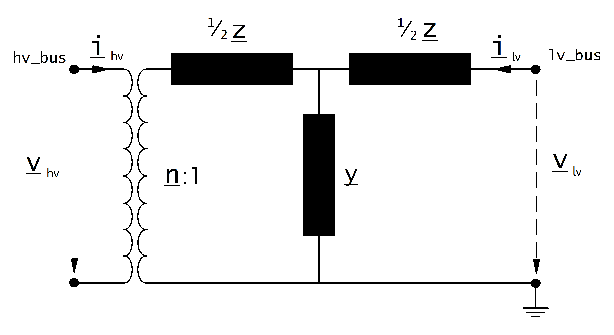
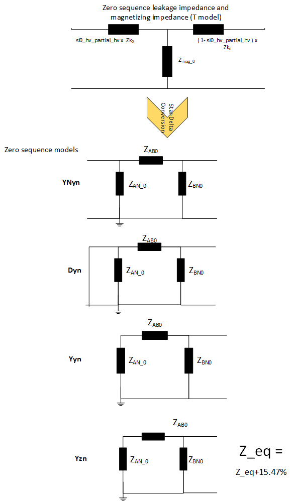

.. _trafo:

=============
Transformer
=============

.. |br| raw:: html

     
    
.. seealso::

    :ref:`Unit Systems and Conventions <conventions>` |br|
    :ref:`Standard Type Libraries <std_types>`

Create Function
=====================

Transformers can be either created from the standard type library (create_transformer) or with custom values (create_transformer_from_parameters).

.. autofunction:: pandapower.create_transformer

.. autofunction:: pandapower.create_transformer_from_parameters

Input Parameters
=====================

*net.trafo*

.. tabularcolumns:: |p{0.15\linewidth}|p{0.1\linewidth}|p{0.25\linewidth}|p{0.4\linewidth}|
.. csv-table:: 
   :file: trafo_par.csv
   :delim: ;
   :widths: 15, 10, 25, 40
  
\*necessary for executing a balanced power flow calculation |br| \*\*optimal power flow parameter |br| \*\*\*necessary for executing a three phase power flow / single phase short circuit |br| \*\*\*\*optional, for modeling a second tap changer

.. note:: The transformer loading constraint for the optimal power flow corresponds to the option trafo_loading="current":

.. note:: vkr_percent can be calculated as follow :

    .. math::
        :nowrap:

        \begin{align*}
        vkr\_percent &= \frac{P\_cu}{S\_trafo} \cdot 100
        \end{align*}

    | Where
    | P\_cu is the power loss in the copper in kW
    | S\_trafo is the rated apparent power of the transformer in kW

Electric Model
=================

The equivalent circuit used for the transformer can be set in the power flow with the parameter "trafo_model".
   
*trafo_model='t':*

*sequence = 0:*

*trafo_model='pi':*

.. image:: trafo_pi.png
	:width: 30em
	:align: center

.. note:: it is possible to specify unequal distributions of leakage resistance and reactance between HV and LV sides

    
Transformer Ratio
-------------------

The magnitude of the transformer ratio is given as:

.. math::
   :nowrap:
   
   \begin{align*}
   n &= \frac{V_{ref, HV, transformer}}{V_{ref, LV, transformer}} \cdot \frac{V_{ref, LV bus}}{V_{ref, HV bus}}
   \end{align*}

The reference voltages of the high and low voltage buses are taken from the net.bus table. The reference voltage of the transformer is taken directly from the transformer table:

.. math::
   :nowrap:
   
   \begin{align*}
    V_{ref, HV, transformer} &= vn\_hv\_kv \\
    V_{ref, LV, transformer} &= vn\_lv\_kv
   \end{align*}
   

If the power flow is run with voltage_angles=True, the complex ratio is given as:

.. math::
   :nowrap:
   
   \begin{align*}
   \underline{n} &= n \cdot e^{j \cdot \theta \cdot \frac{\pi}{180}} \\
   \theta &= shift\_degree 
   \end{align*}
   
Otherwise, the ratio does not include a phase shift:

.. math::
   :nowrap:
   
   \begin{align*}
   \underline{n} &= n
   \end{align*}
   
Impedance Values
------------------

The short-circuit impedance is calculated as:

.. math::
   :nowrap:

   \begin{align*}
   z_k &= \frac{vk\_percent}{100} \cdot \frac{net.sn\_mva}{sn\_mva} \\
   r_k &= \frac{vkr\_percent}{100} \cdot \frac{net.sn\_mva}{sn\_mva} \\
   x_k &= \sqrt{z^2 - r^2} \\
   \underline{z}_k &= r_k + j \cdot x_k
   \end{align*}    

The magnetising admittance is calculated as:

.. math::
   :nowrap:

   \begin{align*}
   y_m &= \frac{i0\_percent}{100} \\
   g_m &= \frac{pfe\_kw}{sn\_mva \cdot 1000} \cdot \frac{net.sn\_mva}{sn\_mva} \\
   b_m &= \sqrt{y_m^2 - g_m^2} \\
   \underline{y_m} &= g_m - j \cdot b_m
   \end{align*}    

The values calculated in that way are relative to the rated values of the transformer. To transform them into the per unit system, they have to be converted to the rated values of the network:

.. math::
   :nowrap:

   \begin{align*}
    Z_{N} &= \frac{V_{N}^2}{S_{N}} \\
    Z_{ref, trafo} &= \frac{vn\_lv\_kv^2 \cdot net.sn\_mva}{sn\_mva} \\
    \underline{z} &= \underline{z}_k \cdot \frac{Z_{ref, trafo}}{Z_{N}} \\
    \underline{y} &= \underline{y}_m \cdot \frac{Z_{N}}{Z_{ref, trafo}} \\
    \end{align*}

Where the reference voltage :math:`V_{N}` is the nominal voltage at the low voltage side of the transformer and the rated apparent power :math:`S_{N}` is defined system wide in the net object (see :ref:`Unit Systems and Conventions<conventions>`). 

Tap Changer
---------------

**Longitudinal regulator (Ratio Tap Changer)**

A longitudinal regulator can be modeled by setting tap_changer_type to "Ratio" and defining the tap changer voltage step with tap_step_percent.

The reference voltage is then multiplied with the tap factor:

.. math::
   :nowrap:
   
   \begin{align*}
    n_{tap} = 1 + (tap\_pos - tap\_neutral) \cdot \frac{tap\_st\_percent}{100}
    \end{align*}
    
On which side the reference voltage is adapted depends on the :math:`tap\_side` variable:

.. tabularcolumns:: |p{0.2\linewidth}|p{0.15\linewidth}|p{0.15\linewidth}|
.. csv-table:: 
   :file: trafo_tap.csv
   :delim: ;
   :widths: 20, 15, 15

.. note::
    The variables tap_min and tap_max are not considered in the power flow. The user is responsible to ensure that tap_min < tap_pos < tap_max!

**Cross regulator (Ratio Tap Changer / Symmetrical Tap Changer)**

In addition to tap_step_percent, the tap_step_degree parameter can be populated to model the fixed angle
between the vectors of the input voltage and additional voltage per tap step :math:`\delta U` (**not tap-dependent**).
This results in a cross regulator that affects the magnitude as well as the angle of the output voltage.
Use tap_changer_type "Ratio", or if the fixed angle :math:`\theta` is 90 degrees, set tap_step_degree to 90 and use
tap_changer_type "Symmetrical".

.. math::
   :nowrap:

   \begin{align*}
    n_{tap} = 1 + (tap\_pos - tap\_neutral) \cdot \frac{tap\_st\_percent}{100} \exp(\mathrm j \phi)
    \end{align*}

**Ideal phase shifter**

If tap_changer_type is set to "Ideal", the tap changer is modeled as an ideal phase shifter, meaning that a constant
angle shift is added with each tap step:

.. math::
   :nowrap:
   
   \begin{align*}
   \underline{n} &= n \cdot e^{j \cdot (\theta + \theta_{tp}) \cdot \frac{\pi}{180}} \\
   \theta &= shift\_degree 
   \end{align*}
   
The angle shift can be directly defined in tap_step_degree (the same parameter as for "Ratio" tap changer is used!), in which case:

.. math::
   :nowrap:
   
   \begin{align*}
   \theta_{tp} = tap\_st\_degree \cdot (tap\_pos - tap\_neutral)
   \end{align*}

or it can be given as a constant voltage step in tap_step_percent, in which case the angle is calculated as:

.. math::
   :nowrap:
   
   \begin{align*}
   \theta_{tp} = 2 \cdot arcsin(\frac{1}{2} \cdot \frac{tap\_st\_percent}{100})  \cdot (tap\_pos - tap\_neutral)
   \end{align*}

If both values are given for an ideal phase shift transformer, the power flow will raise an error.

**Tabular phase shifter**

If tap_changer_type is set to "Tabular", the transformer ratio and phase angle shift per tap step is defined in the
trafo_characteristic_table (see below). One application of the "Tabular" tap changer type is to represent the
PhaseTapChangerTabular class defined in the CIM CGMES dataset. In this case, tap_dependency_table flag must be set
to True.

.. seealso::

    `ENTSO-E - Phase Shift Transformers Modelling, Version 1.0.0, May 2014 <https://eepublicdownloads.entsoe.eu/clean-documents/CIM_documents/Grid_Model_CIM/ENTSOE_CGMES_v2.4_28May2014_PSTmodelling.pdf>`_
    
    `J. Verboomen, D. Van Hertem, P. H. Schavemaker, W. L. Kling and R. Belmans, "Phase shifting transformers: principles and applications," 2005 International Conference on Future Power Systems, Amsterdam, 2005 <https://ieeexplore.ieee.org/document/1600575/>`_

Trafo characteristic table
----------------------------

A transformer characteristic table (trafo_characteristic_table) can be used to adjust the transformer parameters
(voltage ratio, angle, impedance) according to the selected tap position. This lookup table is created automatically
from version 3.0 onwards through the CIM CGMES to pandapower converter (if this information is available in the EQ
profile), or the user may define this table manually. The id_characteristic_table variable in net.trafo references
the id_characteristic column in net.trafo_characteristic_table per transformer.

If the tap_dependency_table variable in net.trafo is set to True, this indicates that there is a corresponding
characteristic available in net.trafo_characteristic_table, which overwrites the default trafo parameters
tap_step_percent, tap_step_degree, vk_percent and vkr_percent.

The below table provides an example trafo_characteristic_table, populated for two 2-winding transformers.

.. tabularcolumns:: |p{0.10\linewidth}|p{0.55\linewidth}|p{0.15\linewidth}|p{0.55\linewidth}|p{0.55\linewidth}|p{0.55\linewidth}|p{0.55\linewidth}|p{0.55\linewidth}|p{0.55\linewidth}|p{0.55\linewidth}|p{0.55\linewidth}|p{0.55\linewidth}|p{0.55\linewidth}
.. csv-table::
   :file: trafo_char_table.csv
   :delim: ,
   :widths: 10, 55, 15, 55, 55, 55, 55, 55, 55, 55, 55, 55, 55

.. note::
    - tap_dependency_table has to be set to True, and id_characteristic_table and tap_changer_type variables need to be populated in order to consider the corresponding trafo_characteristic_table values.
    - Only one tap_dependency_table is supported per 2-winding transformer (there is no tap2_dependency_table variable)

The function pandapower.control.trafo_characteristic_table_diagnostic can be used for sanity checks.
The function pandapower.control.create_trafo_characteristic_object can be used to automatically create
SplineCharacteristic objects and populate the net.trafo_characteristic_spline table according to the
net.trafo_characteristic_table table. An additional column id_characteristic_spline is also created in net.trafo
to set up the reference to the spline characteristics.

The below table provides an example trafo_characteristic_spline table, populated for two 2-winding transformers.

.. tabularcolumns:: |p{0.10\linewidth}|p{0.55\linewidth}|p{0.55\linewidth}|p{0.55\linewidth}|p{0.55\linewidth}|p{0.55\linewidth}|p{0.55\linewidth}|p{0.55\linewidth}|p{0.55\linewidth}|p{0.55\linewidth}|p{0.55\linewidth}|p{0.55\linewidth}
.. csv-table::
   :file: trafo_char_spline.csv
   :delim: ,
   :widths: 10, 55, 55, 55, 55, 55, 55, 55, 55, 55, 55, 55

Result Parameters
==========================
*net.res_trafo*

.. tabularcolumns:: |p{0.15\linewidth}|p{0.10\linewidth}|p{0.55\linewidth}|
.. csv-table:: 
   :file: trafo_res.csv
   :delim: ;
   :widths: 15, 10, 55

.. math::
   :nowrap:
   
   \begin{align*}
    p\_hv\_mw &= Re(\underline{v}_{hv} \cdot \underline{i}^*_{hv}) \\    
    q\_hv\_mvar &= Im(\underline{v}_{hv} \cdot \underline{i}^*_{hv}) \\
    p\_lv\_mw &= Re(\underline{v}_{lv} \cdot \underline{i}^*_{lv}) \\
    q\_lv\_mvar &= Im(\underline{v}_{lv} \cdot \underline{i}^*_{lv}) \\
	pl\_mw &= p\_hv\_mw + p\_lv\_mw \\
	ql\_mvar &= q\_hv\_mvar + q\_lv\_mvar \\
    i\_hv\_ka &= i_{hv} \\
    i\_lv\_ka &= i_{lv}
    \end{align*}
    
*net.res_trafo_3ph*

.. tabularcolumns:: |p{0.15\linewidth}|p{0.10\linewidth}|p{0.55\linewidth}|
.. csv-table:: 
   :file: trafo_res_3ph.csv
   :delim: ;
   :widths: 15, 10, 55

.. math::
   :nowrap:
   
   \begin{align*}
    p\_hv\_mw_{phase} &= Re(\underline{v}_{hv_{phase}} \cdot \underline{i}^*_{hv_{phase}}) \\    
    q\_hv\_mvar_{phase} &= Im(\underline{v}_{hv_{phase}} \cdot \underline{i}^*_{hv_{phase}}) \\
    p\_lv\_mw_{phase} &= Re(\underline{v}_{lv_{phase}} \cdot \underline{i}^*_{lv_{phase}}) \\
    q\_lv\_mvar_{phase} &= Im(\underline{v}_{lv_{phase}} \cdot \underline{i}^*_{lv_{phase}}) \\
	pl\_mw_{phase} &= p\_hv\_mw_{phase} + p\_lv\_mw_{phase} \\
	ql\_mvar_{phase} &= q\_hv\_mvar_{phase} + q\_lv\_mvar_{phase} \\
    i\_hv\_ka_{phase} &= i_{hv_{phase}} \\
    i\_lv\_ka_{phase}&= i_{lv_{phase}}
    \end{align*}

The definition of the transformer loading depends on the trafo_loading parameter of the power flow.

For trafo_loading="current", the loading is calculated as:

.. math::
   :nowrap:
   
   \begin{align*}  
    loading\_percent &= max(\frac{i_{hv} \cdot vn\_hv\_kv}{sn\_mva}, \frac{i_{lv} \cdot vn\_lv\_kv}{sn\_mva})  \cdot 100
   \end{align*}
    

For trafo_loading="power", the loading is defined as:
    
.. math::
   :nowrap:
   
   \begin{align*}  
    loading\_percent &= max( \frac{i_{hv} \cdot v_{hv}}{sn\_mva}, \frac{i_{lv} \cdot v_{lv}}{sn\_mva}) \cdot 100
    \end{align*} 

*net.res_trafo_sc*

The short-circuit (SC) results are put into *net.res_trafo_sc* with following definitions:

.. tabularcolumns:: |p{0.15\linewidth}|p{0.10\linewidth}|p{0.55\linewidth}|
.. csv-table:: 
   :file: trafo_res_sc.csv
   :delim: ;
   :widths: 15, 10, 55