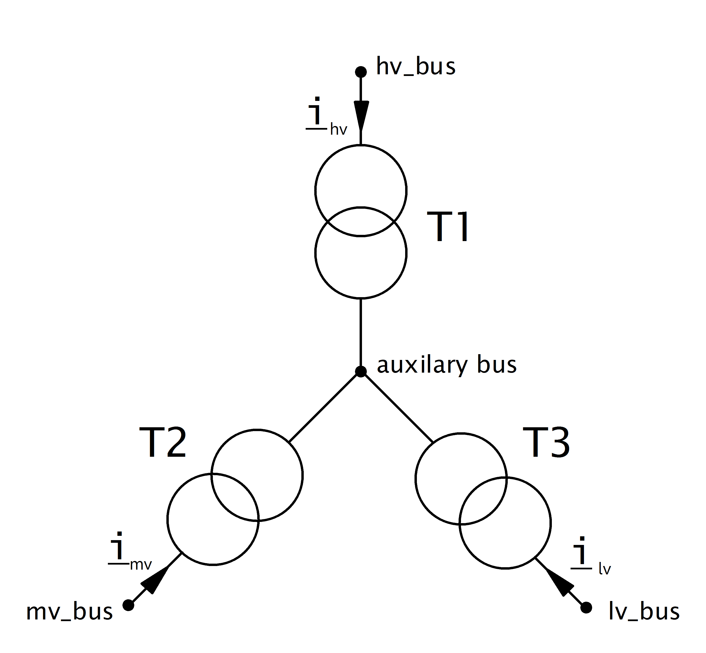

===========================
Three Winding Transformer
===========================

.. |br| raw:: html

     
    
.. seealso::

    :ref:`Unit Systems and Conventions <conventions>` |br|
    :ref:`Standard Type Libraries <std_types>`

Create Function
=====================

.. _create_trafo3w:

.. autofunction:: pandapower.create.create_transformer3w

.. autofunction:: pandapower.create.create_transformer3w_from_parameters
.. note::
    All short circuit voltages are given relative to the minimum apparent power
    flow. For example vk_hv_percent is the short circuit voltage from the high to
    the medium level, it is given relative to the minimum of the rated apparent
    power in high and medium level: min(sn_hv_mva, sn_mv_mva). This is consistent
    with most commercial network calculation software (e.g. PowerFactory).
    Some tools (like PSS Sincal) however define all short ciruit voltages relative
    to the overall rated apparent power of the transformer:
    max(sn_hv_mva, sn_mv_mva, sn_lv_mva). You might have to convert the
    values depending on how the short-circuit voltages are defined.

Input Parameters
=========================

*net.trafo3w*

.. tabularcolumns:: |p{0.15\linewidth}|p{0.1\linewidth}|p{0.25\linewidth}|p{0.4\linewidth}|
.. csv-table:: 
   :file: trafo3w_par.csv
   :delim: ;
   :widths: 15, 10, 10, 30

\*necessary for executing a power flow calculation.

.. note:: Three Winding Transformer loading can not yet be constrained with the optimal power flow.

.. _trafo3w_model:

Electric Model
=================

Three Winding Transformers are modelled by three two-winding transformers in :math:`Y`-connection:

The parameters of the three transformers are defined as follows:

.. tabularcolumns:: |p{0.15\linewidth}|p{0.15\linewidth}|p{0.15\linewidth}|p{0.15\linewidth}|
.. csv-table:: 
   :file: trafo3w_conversion.csv
   :delim: ;
   :widths: 10, 15, 15, 15

The iron loss (pfe\_kw) and open loop loss (i0\_percent) of the 3W transformer is by default attributed to T1 ('hv').
The parameter 'trafo3w\_losses' in the runpp function however also allows to assign the losses to T2 ('mv'), T3('lv') or to the star point ('star').
   
To calculate the short-circuit voltages :math:`v_{k, t1..t3}` and :math:`v_{r, t1..t3}`, first all short-circuit voltages are converted from side based
values to branch based values

.. math::
   :nowrap:

   \begin{align*}
    v'_{k, hm} &= vk\_hv\_percent \cdot \frac{sn\_hv\_mva}{min(sn\_hv\_mva, sn\_mv\_mva)} \\
    v'_{k, ml} &= vk\_mv\_percent \cdot \frac{sn\_hv\_mva}{min(sn\_mv\_mva, sn\_lv\_mva)} \\
    v'_{k, lh} &= vk\_lv\_percent \cdot \frac{sn\_hv\_mva}{min(sn\_hv\_mva, sn\_lv\_mva)}
    \end{align*}   
    
These transformer now represent a :math:`\Delta` connection of the equivalent transformers. A :math:`\Delta-Y` conversion is therefore applied to recieve the parameters in :math:`Y`-connection:

.. math::
   :nowrap:

   \begin{align*}
    v'_{k, T1} &= \frac{1}{2} (v'_{k, hm} + v'_{k, lh} - v'_{k, ml}) \\
    v'_{k, T2} &= \frac{1}{2} (v'_{k, ml} + v'_{k, hm} - v'_{k, lh}) \\
    v'_{k, T3} &= \frac{1}{2} (v'_{k, ml} + v'_{k, lh} - v'_{k, hm})
    \end{align*}
    
Since these voltages are given relative to the high voltage side, they have to be transformed back to the voltage level of each transformer:

.. math::
   :nowrap:

   \begin{align*}
    v_{k, T1} &= v'_{k, t1} \\
    v_{k, T2} &= v'_{k, t2} \cdot \frac{sn\_mv\_mva}{sn\_hv\_mva} \\
    v_{k, T3} &= v'_{k, t3} \cdot \frac{sn\_lv\_mva}{sn\_hv\_mva}
    \end{align*}

The real part of the short-circuit voltage is calculated in the same way.

The definition of how impedances are calculated for the two winding transformer from these parameters can be found :ref:`here<trafo>`.

.. note::
    All short circuit voltages are given relative to the maximum apparent power
    flow. For example vk_hv_percent is the short circuit voltage from the high to
    the medium level, it is given relative to the minimum of the rated apparent
    power in high and medium level: min(sn_hv_mva, sn_mv_mva). This is consistent
    with most commercial network calculation software (e.g. PowerFactory).
    Some tools (like PSS Sincal) however define all short circuit voltages relative
    to the overall rated apparent power of the transformer:
    max(sn_hv_mva, sn_mv_mva, sn_lv_mva). You might have to convert the
    values depending on how the short-circuit voltages are defined.

The tap changer adapts the nominal voltages of the transformer in the equivalent to the 2W-Model:

.. tabularcolumns:: |p{0.2\linewidth}|p{0.15\linewidth}|p{0.15\linewidth}|p{0.15\linewidth}|
.. csv-table:: 
   :file: trafo3w_tap.csv
   :delim: ;
   :widths: 20, 15, 15, 15

with 

.. math::
   :nowrap:
   
   \begin{align*}
    n_{tap} = 1 + (tap\_pos - tap\_neutral) \cdot \frac{tap\_st\_percent}{100}
    \end{align*}

The variable tap\_side controls if the tap changer is located at T1 ('hv'), T2 ('mv') or T3 ('lv'). The tap\_at\_star\_point variable controls if the tap changer
is located at the star point of the three winding transformer or at the terminal side (hv/mv/lv bus).
    
.. seealso::
    `MVA METHOD FOR 3-WINDING TRANSFORMER <https:/pangonilo.com/index.php?sdmon=files/MVA_Method_3-Winding_Transformer.pdf>`_

    

Result Parameters
==========================
**net.res_trafo3w**

.. tabularcolumns:: |p{0.15\linewidth}|p{0.1\linewidth}|p{0.60\linewidth}|
.. csv-table:: 
   :file: trafo3w_res.csv
   :delim: ;
   :widths: 15, 10, 60

.. math::
   :nowrap:
   
   \begin{align*}
    p\_hv\_mw &= Re(\underline{v}_{hv} \cdot \underline{i}_{hv}) \\    
    q\_hv\_mvar &= Im(\underline{v}_{hv} \cdot \underline{i}_{hv}) \\
    p\_mv\_mw &= Re(\underline{v}_{mv} \cdot \underline{i}_{mv}) \\    
    q\_mv\_mvar &= Im(\underline{v}_{mv} \cdot \underline{i}_{mv}) \\
    p\_lv\_mw &= Re(\underline{v}_{lv} \cdot \underline{i}_{lv}) \\
    q\_lv\_mvar &= Im(\underline{v}_{lv} \cdot \underline{i}_{lv}) \\
	pl\_mw &= p\_hv\_mw + p\_lv\_mw \\
	ql\_mvar &= q\_hv\_mvar + q\_lv\_mvar \\
    i\_hv\_ka &= i_{hv} \\
    i\_mv\_ka &= i_{mv} \\
    i\_lv\_ka &= i_{lv}
    \end{align*}
    
The definition of the transformer loading depends on the trafo_loading parameter of the power flow.

For trafo_loading='current', the loading is calculated as:

.. math::
   :nowrap:
   
   \begin{align*}  
    loading\_percent &= max(\frac{i_{hv} \cdot vn\_hv\_kv}{sn\_hv\_mva}, \frac{i_{mv} \cdot vn\_mv\_kv}{sn\_mv\_mva}, \frac{i_{lv} \cdot vn\_lv\_kv}{sn\_lv\_mva})  \cdot 100
   \end{align*}
    

For trafo_loading='power', the loading is defined as:
    
.. math::
   :nowrap:
   
   \begin{align*}  
    loading\_percent &= max( \frac{i_{hv} \cdot v_{hv}}{sn\_hv\_mva}, \frac{i_{mv} \cdot v_{mv}}{sn\_mv\_mva}, \frac{i_{lv} \cdot v_{lv}}{sn\_lv\_mva}) \cdot 100
    \end{align*}

**net.res_trafo3w_sc**

The short-circuit (SC) results are put into *net.res_trafo3w_sc* with following definitions:

.. tabularcolumns:: |p{0.15\linewidth}|p{0.1\linewidth}|p{0.60\linewidth}|
.. csv-table:: 
   :file: trafo3w_res_sc.csv
   :delim: ;
   :widths: 15, 10, 60
