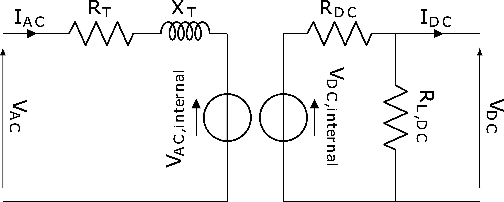

.. _vsc:

==============================================
Voltage Source Converter (VSC)
==============================================

We implemented VSC as part of the VSC HVDC FACTS device based on the following source:

    A. Panosyan, "Modeling of advanced power transmission system controllers",
    Ph.D. dissertation, Gottfried Wilhelm Leibniz Universität Hannover, 2010.

The Voltage Source Converter (VSC), is a power electronic device used to convert alternating current (AC) to direct
current (DC) and vice versa. It connects an AC system to a DC system. The VSC is connected with a coupling
transformer to the ac system. In pandapower the VSC model includes the coupling transformer and considers it via
the input parameters r\_ohm and x\_ohm.

.. seealso::
    :ref:`Unit Systems and Conventions <conventions>`

Create Function
=====================

.. autofunction:: pandapower.create.create_vsc

Input Parameters
=====================

*net.vsc*

.. tabularcolumns:: |p{0.10\linewidth}|p{0.10\linewidth}|p{0.25\linewidth}|p{0.4\linewidth}|
.. csv-table:: 
   :file: vsc_par.csv
   :delim: ;
   :widths: 10, 10, 25, 40

\*necessary for executing a power flow calculation.

   
Electric Model
=================

Voltage Source Converters VSC are self-commutated converters to connect HVAC and HVDC systems using devices suitable
for high power electronic applications, such as IGBTs.

The corresponding terminal-admittance equation is given as:

.. math::
   :nowrap:
   
    \begin{align*}
    \underline{Y}_{T} (\underline{V}_{1} - \underline{V}_{VSC}) = \underline{I}_{1}
    \end{align*}

Where :math:`\underline{Y}_{T}` = 1/:math:`\underline{Z}_{T}` is the admittance of the lossless-assumed coupling transformer between
the VSC and the ac system. :math:`\underline{V}_{VSC}` stands for the VSC output Voltage.

Result Parameters
==========================
*net.res_vsc*

.. tabularcolumns:: |p{0.10\linewidth}|p{0.10\linewidth}|p{0.40\linewidth}|
.. csv-table:: 
   :file: vsc_res.csv
   :delim: ;
   :widths: 10, 10, 40
