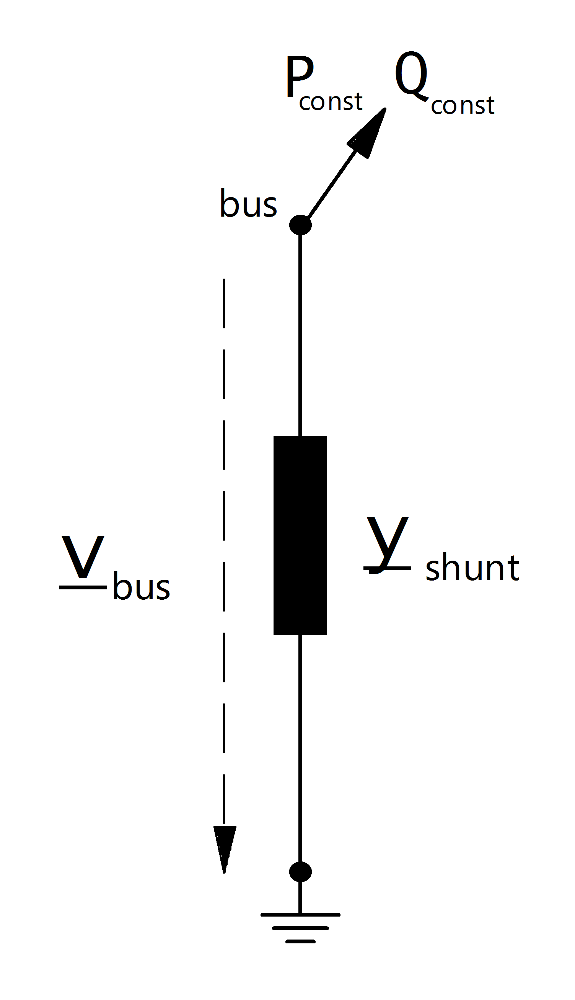

.. _ward:

=============
Ward
=============

.. seealso::
    :ref:`Unit Systems and Conventions <conventions>`

Create Function
=====================

.. autofunction:: pandapower.create.create_ward

Input Parameters
=========================

*net.ward*

.. tabularcolumns:: |p{0.10\linewidth}|p{0.10\linewidth}|p{0.15\linewidth}|p{0.40\linewidth}|
.. csv-table:: 
   :file: ward_par.csv
   :delim: ;
   :widths: 10, 10, 15, 40

\*necessary for executing a power flow calculation.

   
Electric Model
=================

The ward equivalent is a combination of a constant apparent power consumption and a constant impedance load. The constant apparent power is given by:

.. math::
   :nowrap:
   
   \begin{align*}
   P_{const} &= ps\_mw\\
   Q_{const} &= qs\_mvar\\
   \end{align*}
    
The shunt admittance part of the ward equivalent is calculated as described :ref:`here<shunt>`:

.. math::
   :nowrap:
   
   \begin{align*}
   \underline{y}_{shunt} &= \frac{pz\_mw + j \cdot qz\_mvar}{S_{N}}
   \end{align*}

Result Parameters
==========================
*net.res_ward*

.. tabularcolumns:: |p{0.10\linewidth}|p{0.10\linewidth}|p{0.50\linewidth}|
.. csv-table:: 
   :file: ward_res.csv
   :delim: ;
   :widths: 10, 10, 50

.. math::
   :nowrap:
   
   \begin{align*}
   vm\_pu &= v_{bus} \\
   p\_mw &= P_{const} + Re(\frac{\underline{V}_{bus}^2}{\underline{Y}_{shunt}}) \\
   q\_mvar &= Q_{const} + Im(\frac{\underline{V}_{bus}^2}{\underline{Y}_{shunt}})
   \end{align*}
