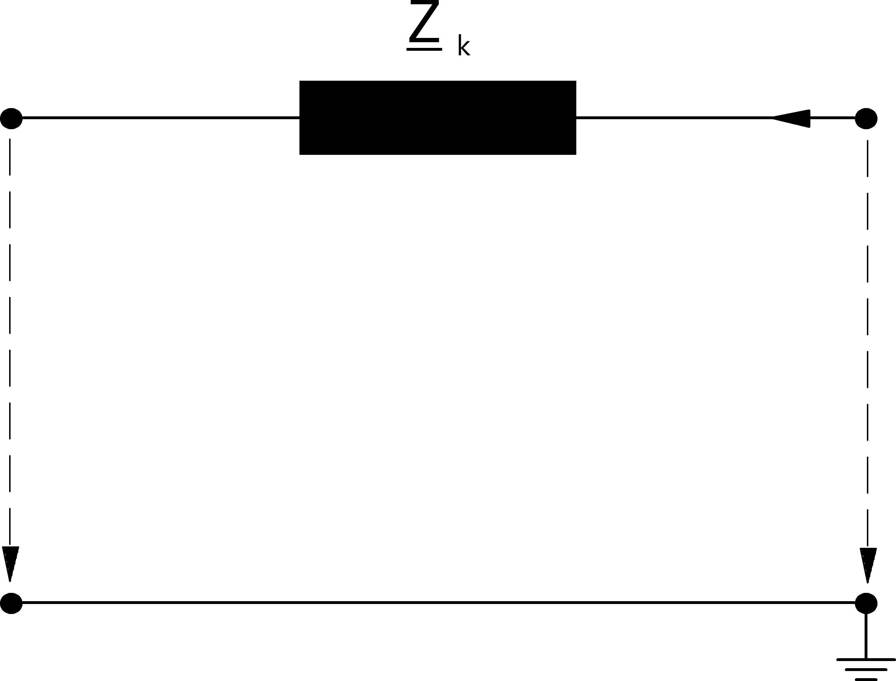
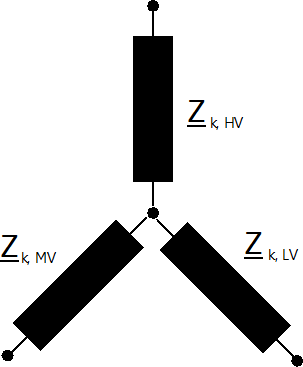

Branch Elements
=================

Branches are represented by a single short circuit impedance:

    
Shunt admittances are neglected for all branch elements. 

Line
-----------------------

.. math::
   :nowrap:

   \begin{align*}
    \underline{R}_k &= r\_ohm\_per\_km \cdot \frac{length\_km}{parallel} \cdot K_L\\
    \underline{X}_k &= x\_ohm\_per\_km \cdot \frac{length\_km}{parallel} 
   \end{align*}
   
where the correction factor for the short-circuit resistance  :math:`K_L` is defined as:

.. math::

  K_L=\left\{
  \begin{array}{@{}ll@{}}
            1 & \text{ for maximum short-circuit calculations} \\
            1 + 0.04 K^{-1} (endtemp\_degree - 20°C) & \text{ for minimum short-circuit calculations} 
  \end{array}\right.

The end temperature in degree after a fault has to be defined with the parameter endtemp\_degre in the line table.

Two-Winding Transformer
-------------------------

The short-circuit impedance is calculated as:

.. math::
   :nowrap:

   \begin{align*}
   z_k &= \frac{vk\_percent}{100} \cdot \frac{1000}{sn\_kva} \cdot K_T \\
   r_k &= \frac{vkr\_percent}{100} \cdot \frac{1000}{sn\_kva} \cdot K_T \\
   x_k &= \sqrt{z^2 - r^2} \\
   \end{align*}    

where the correction factor :math:`K_T` is defined in the standard as:

.. math::

    K_{T} = 0.95 \frac{c_{max}}{1 + 0.6 x_T}

where :math:`c_{max}` is the :ref:`voltage correction factor <c>` on the low voltage side of the transformer and :math:`x_T` is the transformer impedance relative to the
rated values of the transformer.

The ratio of the transformer is considered to be the nominal ratio, the tap changer positions are not considered according to the standard.
When the superposition method is used, the impedance correction factor is not applied to transformers.

Three-Winding Transformer
--------------------------
Three Winding Transformers are modelled by three two-winding transformers:

The conversion from one two to three two winding transformer parameter is described :ref:`here<trafo3w_model>`.
    
For the short-circuit calculation, the loss parameters are neglected and the transformer correction factor is
applied for the equivalent two-winding transformers as follows:

.. math::
   :nowrap:

   \begin{align*}
    v'_{k, t1} &= \frac{1}{2} (v'_{k, h} \cdot K_{T, h} + v'_{k, l} \cdot K_{T, l} - v'_{k, m} \cdot K_{T, m}) \\
    v'_{k, t2} &= \frac{1}{2} (v'_{k, m} \cdot K_{T, m} + v'_{k, h} \cdot K_{T, h} - v'_{k, l} \cdot K_{T, l}) \\
    v'_{k, t3} &= \frac{1}{2} (v'_{k, m} \cdot K_{T, m} + v'_{k, l} \cdot K_{T, l} - v'_{k, h} \cdot K_{T, h})
    \end{align*}
    
Note that the correction factor has to be applied to the transformers before the wye-delta and not on the resulting 
two-winding transformers. 

Impedance
--------------------------
The impedance element is a generic element that is not desribed in the standard. It is considered in the short-circuit calculation just as in the power flow as described :ref:`here <impedance_model>`.

