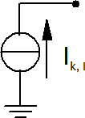

Current Source Elements
================================

Full converter elements, such as PV plants or wind parks, are modeled as current sources:

All static generator elements are assumed to be full converter elements except if the type is specified as "motor", in which case they are treated as asynchronous machines.
Furthermore, their type can be specified as "async" in which case they are considered as asynchronous machines. Finally, the type can be specified as "async doubly fed",
in which case they are considered as Doubly-Fed Asynchronous Generators (DFIG).
    
The inductive short circuit current is calculated from the parameters given in the sgen table as:

.. math::
    \underline{I}_k = \cdot \frac{k \cdot s\_n\_kva}{\sqrt{3} \cdot vn\_kv} \cdot \exp(1j \cdot -\phi_i)

where :math:`s\_n\_kva` is the rated power of the generator and :math:`k` is the ratio of nominal to short circuit current. :math:`vn\_kv` is the rated voltage of the bus the generator is connected to. :math:`\phi_i` is the current angle of the current injection (default value is the impedance angle at the connection bus plus the pre-fault voltage angle, if applicable)
