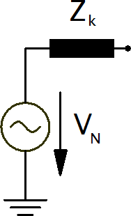
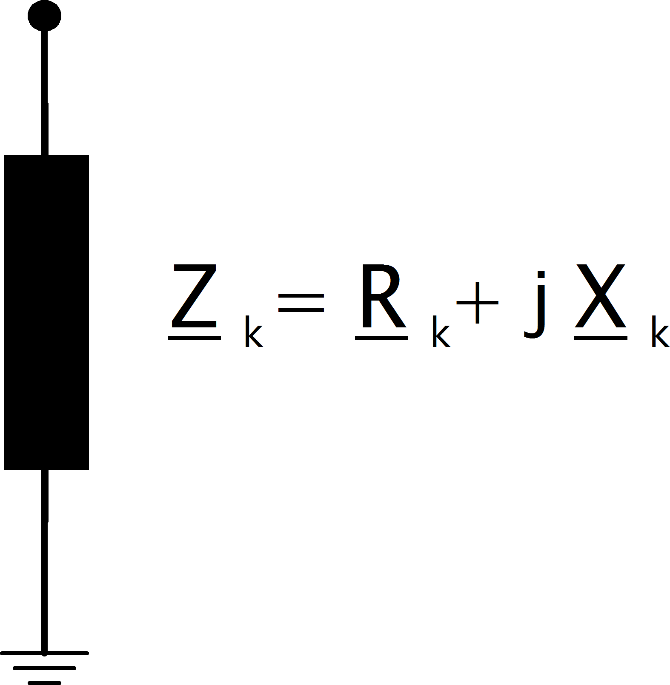

Voltage Source Elements
================================

Voltage source elements are represented by their internal voltage source with an internal resistance :math:`Z_k`:

    
since the voltage source is moved to the fault location for with methodology of the equivalent voltage source, the bus elements
can be reduced to a single shunt impedance:
 

The contribution of loads and shunts are negligible according to the standard and therefore neglected in the short-circuit calculation.
    
External Grid
-----------------

When calculating maximum short-circuit currents, the impedance of an external grid connection is given as:

.. math::

  z_{k, eg} =& \frac{c_{max}}{s\_sc\_max\_mva} \\[1em]
  x_{k, eg} =& \frac{z_{sg}}{\sqrt{1 + rx\_max^2}} \\[1em]
  r_{k, eg} =& rx\_max \cdot x_{sg} 
  
where :math:`rx\_max` and :math:`s\_sc\_max\_mva` are parameters in the ext_grid table and :math:`c_{max}` is the :ref:`voltage correction factor <c>` of the
external grid bus.

In case of minimal short-circuit currents, the impedance is calculated accordingly:

.. math::

  z_{k, eg} =& \frac{c_{min}}{s\_sc\_min\_mva} \\[1em]
  x_{k, eg} =& \frac{z_{sg}}{\sqrt{1 + rx\_min^2}} \\[1em]
  r_{k, eg} =& rx\_min \cdot x_{sg} 

Asynchronous Motor
-----------------------
Asynchronous motors can be considered by setting the type variable of an sgen element to "motor". The internal impedance is then calculated as:

.. math::

    Z_{k, m} = \frac{1}{k} \cdot \frac{vn\_kv^2 \cdot 1000}{sn\_kva} \\
    X_{k, m} = \frac{Z_{sg}}{\sqrt{1 + rx^2}} \\
    R_{k, m} = rx \cdot X_{sg}

where :math:`sn\_kva` is the rated power of the motor, :math:`k` is the ratio of nominal to short circuit current and :math:`rx` is the R/X ratio of the motor.
:math:`vn\_kv` is the rated voltage of the bus the motor is connected to.

    
Synchronous Generator
-----------------------
Synchronous generators are considered with the short-circuit impedance of:

.. math::
    \underline{Z}_{k, gen} = K_G \cdot (R''_d + jX''_d)

The short-circuit impedance is calculated as:

.. math::

    z_k = xdss  
    
The generator correction factor :math:`K_G` is given as:

.. math::

    K_G = \frac{V_{N, gen}}{V_{N, bus}} \cdot \frac{c_{max}}{1 + x_{dss} \cdot sin(\varphi)}
    
where :math:`V_{N, bus}` is the rated voltage of the bus the generator is connected to and :math:`V_{N, gen}` is the rated voltage of the 
generator which is defined by the parameter :math:`\text{sn\_kva}` in the gen table. The rated phasor angle :math:`\varphi` is given as:

.. math::

    \varphi = arcos(cos\_phi)
    
where :math:`cos\_phi` is defined in the gen table.

