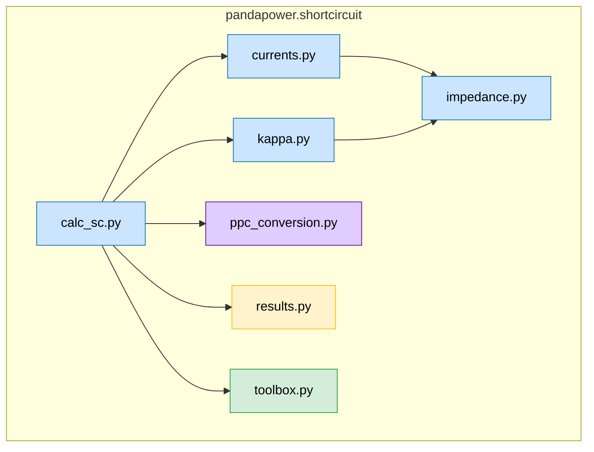

# Short circuit calculations in pandapower

## Code and function structure

#
### calc_sc.py
| Function             | Type     | Description                                                                                                                                                                                                                    |
|----------------------|----------|--------------------------------------------------------------------------------------------------------------------------------------------------------------------------------------------------------------------------------|
| `calc_sc(net, ...)`  | Main     | Entry point for short-circuit calculations. Handles user options, fault types (LLL, LL, LG, LLG), minimal/maximal case, branch results, and initializes PPC and results tables.                                                |
| `_calc_sc(net, bus)` | Internal | Performs the detailed short-circuit calculations. Initializes PPC/PPci, computes sequence impedances (positive, negative, zero), applies kappa, calculates short-circuit currents, and extracts results into `net.res_bus_sc`. |
#
### currents.py
| Function                                                                             | Type                        | Description                                                                                                                                                                                                                                                                                                                                                                                                                                                                                    |
|--------------------------------------------------------------------------------------|-----------------------------|------------------------------------------------------------------------------------------------------------------------------------------------------------------------------------------------------------------------------------------------------------------------------------------------------------------------------------------------------------------------------------------------------------------------------------------------------------------------------------------------|
| `_calc_ikss_to_g(net, ppci_0, ppci_1, ppci_2, bus_idx)`                              | Internal                    | Calculates the short-circuit currents (IKSS) at the buses for different fault types (LLL, LL, LG, LLG). Initializes base currents, computes equivalent impedances, considers pre-fault voltages, and applies Ybus- or Zbus-based methods. Updates IKSS, IKSSC, SKSS, and voltage information in ppci.                                                                                                                                                                                          |
| `_current_source_current(net, ppci, bus_idx, sequence=1)`                            | Internal                    | Calculates the current source contributions (e.g., from generators/synchronous motors) for short-circuit cases. Considers fault type, minimal/maximal cases, pre-fault voltage settings, and fault impedance. Sets IKCV and IKSSC to the corresponding values.                                                                                                                                                                                                                                 |
| `_calc_ip(net, ppci)`                                                                | Internal                    | Calculates the peak short-circuit current (Ip) at each bus. Uses the prefault voltage contribution (IKSSV), the short-circuit current contribution from current sources (IKSSC), and the kappa factor. Stores the result in ppci["bus"][:, IP].                                                                                                                                                                                                                                                |
| `_calc_ith(net, ppci)`                                                               | Internal                    | Calculates the thermal equivalent short-circuit current (Ith) for each bus. Computes the factor m based on kappa and fault duration, combines it with prefault and source contributions, and stores the result in ppci["bus"][:, ITH].                                                                                                                                                                                                                                                         |
| `nan_minmax(a, rows, argminmax)`                                                     | Helper                      | Computes the row-wise minimum or maximum of a 2D array a, ignoring NaN values and handling complex numbers by magnitude. Returns an array of the same length as a with computed min/max values.                                                                                                                                                                                                                                                                                                |
| `_calc_branch_currents_complex(net, bus_idx, ppci0, ppci1, ppci2, sequence)`         | Internal (Core calculation) | Calculates branch short-circuit currents (both magnitude and angle) for a given sequence (0: zero, 1: positive, 2: negative) in a power grid. Handles: Voltage source contributions (ikssv), current source contributions (ikcv), different fault types (LG, LL, LLL, LLG), power and voltage calculations for branches , optional calculation of peak (Ip) and thermal (Ith) currents, stores results either in ppci["internal"] (all currents) or in ppci["branch"] (min/max per branch). |                                                                                                                                                                                                                                                                                                                      
#
### impedance.py
| Function                                   | Type     | Description                                                                                                                                                                                                               |
|--------------------------------------------|----------|---------------------------------------------------------------------------------------------------------------------------------------------------------------------------------------------------------------------------|
| `_calc_rx(net, ppci, bus_idx, sequence)`   | Internal | Computes equivalent bus impedance (R and X) for a given bus or set of buses under a fault, accounting for fault type (LL, 3-phase, etc.) and optional fault impedance. Updates ppci["bus"] with real and imaginary parts. |
| `_calc_ybus(ppci)`                         | Internal | Builds the Y-bus admittance matrix from bus and branch data. Cleans very small off-diagonal entries. Stores Ybus, Yf, Yt in ppci["internal"].                                                                             |
| `_calc_zbus(net, ppci)`                    | Internal | Computes the Z-bus (bus impedance matrix) by inverting Y-bus. Uses sparse inversion if the matrix is very sparse, dense inversion otherwise. Cleans up grid on error.                                                  |
| `_calc_zbus_diag(net, ppci, bus_idx=None)` | Internal | Computes the diagonal elements of Z-bus (self-impedances). Can compute for all buses or a subset. Uses ybus_fact linear solver for efficiency. Returns diagZ.                                                             |
#
### kappa.py
| Function                      | Type     | Description                                                                                                                                                                                                  |
|-------------------------------|----------|--------------------------------------------------------------------------------------------------------------------------------------------------------------------------------------------------------------|
| `_add_kappa_to_ppc(net, ppc)` | Internal | Adds the KAPPA factor to the bus data in ppc depending on the selected method (B or C) or radial topology. Preserves existing KAPPA if already defined.                                                      |
| `_kappa(rx)`                  | Internal | Computes the basic Kappa factor from the R/X ratio using an exponential formula.                                                                                                                             |
| `_kappa_method_c(net, ppc)`   | Internal | Computes Kappa factors for method “C”. Adjusts branch reactances for frequency, updates shunt admittances, calculates Ybus and Zbus, and then computes equivalent R/X ratios. Returns computed Kappa values. |
| `_kappa_method_b(net, ppc)`   | Internal | Computes Kappa factors for method “B” based on topology (radial/meshed/auto) and bus voltage level. Applies corrections for meshed grids and limits by kappa_max.                                         |
| `nxgraph_from_ppc(net, ppc)`  | Helper   | Builds a gridx MultiGraph representing the grid from ppc. Includes buses, branches, and connections to “earth” based on generator and shunt impedances. Used for topology-based Kappa calculations.    |
#
### ppc_conversion.py
| Function                   | Type     | Description                                                                                                                                |
|----------------------------|----------|--------------------------------------------------------------------------------------------------------------------------------------------|
| `_get_is_ppci_bus`         | Internal | Returns the Pypower internal bus indices for buses marked in net._is_elements_final["bus_is_idx"].                                         |
| `_init_ppc`                | Internal | Initializes a Pandapower case (ppc) and its internal variant (ppci) for short-circuit calculations.                                        |
| `_check_sc_data_integrity` | Internal | Ensures all required columns for short-circuit calculation exist in net.gen and net.trafo.                                                 |
| `_add_kt`                  | Internal | Adds transformer correction factor K_T to branch entries in the ppc.                                                                       |
| `_add_ward_sc_z`           | Internal | Calculates short-circuit admittances (GS, BS) for Ward equivalents and adds them to ppc["bus"].                                            |
| `_add_sgen_sc_z`           | Internal | Calculates short-circuit admittances for sgen elements, including doubly-fed asynchronous generators, and updates KAPPA for peak currents. |
| `_add_gen_sc_z_kg_ks`      | Internal | Calculates generator short-circuit impedance (GS, BS), peak current factors (K_G, K_SG), and updates ppc and branch entries accordingly.   |
| `_create_k_updated_ppci`   | Internal | Creates a ppci copy with updated short-circuit factors (K_G, K_SG, K_ST) applied to generators and transformers.                           |
#
### results.py
| Function                                                              | Type     | Description                                                                                                                                                                                                                                                                   |
|-----------------------------------------------------------------------|----------|-------------------------------------------------------------------------------------------------------------------------------------------------------------------------------------------------------------------------------------------------------------------------------|
| `_copy_result_to_ppci_orig`                                           | Internal | Copies branch and bus short-circuit results from one ppci structure to another, handling max/min cases and additional branch results (currents, powers, voltages). Handles both all-currents mode and reduced results mode.                                                   |
| `_get_bus_ppc_idx_for_br_all_results`                                 | Internal | Returns the original bus indices and corresponding ppc bus indices for branches, masking out disconnected or invalid buses (BUS_TYPE == 4).                                                                                                                                   |
| `_calculate_branch_phase_results`                                     | Internal | Computes per-phase branch results (voltages, currents, apparent power) from sequence-domain short-circuit results for three sequences (0, 1, 2). Converts sequence components to phase components and applies thresholds for numerical stability.                             |
| `_get_line_branch_results(net, ppc_1, v_abc_pu, i_abc_ka, s_abc_mva)` | Internal | Calculates and stores short-circuit results per line branch and phase (ikss, p, q, vm, va) for “from” and “to” sides in net.res_line_sc. Handles LLL fault scaling.                                                                                                           |
| `_get_trafo_lg_results(net, v_abc_pu, i_abc_ka, s_abc_mva)`           | Internal | Calculates and stores short-circuit results for transformers per phase and side (hv, lv) in net.res_trafo_sc.                                                                                                                                                                 |
| `_calculate_bus_results_llg(ppc_0, ppc_1, ppc_2, bus, net)`           | Internal | Calculates LLG (line-to-line-to-ground) short-circuit currents and powers at buses, converts sequence currents to phase quantities, stores ikss and skss per phase in net.res_bus_sc.                                                                                         |
| `_extract_results(net, ppc_0, ppc_1, ppc_2, bus)`                     | Internal | Main result extraction function. Determines the fault type and triggers bus, line, and transformer result calculations depending on options (branch_results, return_all_currents).                                                                                            |
| `_get_bus_results(net, ppc_0, ppc_1, ppc_2, bus)`                     | Internal | Calculates bus-level short-circuit results for different fault types (LG, LLG, LL). Populates ikss, skss, sequence impedances, and optionally ip/ith in net.res_bus_sc.                                                                                                       |
| `_get_line_results(net, ppc)`                                         | Internal | Calculates line-level short-circuit results using precomputed branch values (ikss, p, q, vm, va). Supports optional ip and ith.                                                                                                                                               |
| `_get_switch_results(net, ppc)`                                       | Internal | Computes short-circuit results for switches (ikss, optional ip and ith) by taking min/max of “from” and “to” branch values depending on case. Also calculates switch loading percent if in_ka is defined. Calls _copy_switch_results_from_branches for additional processing. |
| `_get_branch_result_from_internal(variable, ppc, ppc_index, f, t)`    | Internal | Extracts a specified internal branch result from ppc["internal"] for a range of rows (f:t) and given bus indices (ppc_index). Returns a column vector or NaNs if variable not found.                                                                                          |
| `_get_line_all_results(net, ppc, bus)`                                | Internal | Populates net.res_line_sc for all buses. Handles multi-bus results (ikss, p, q, vm, va) for both “from” and “to” ends, optionally ip and ith, using _get_branch_result_from_internal. Respects case (max/min).                                                                |
| `_get_switch_all_results(net, ppc, bus)`                              | Internal | Similar to _get_line_all_results but for switches. Populates net.res_switch_sc with multi-bus short-circuit results (ikss, optional ip and ith).                                                                                                                              |
| `_get_trafo_results(net, ppc)`                                        | Internal | Extracts transformer short-circuit results from ppc["branch"] for HV/LV sides: currents (ikss), angles, powers (p, q), and voltages (vm, va).                                                                                                                                 |
| `_get_trafo_all_results(net, ppc, bus)`                               | Internal | Populates net.res_trafo_sc with multi-bus results using internal branch values for HV and LV sides (ikss_hv_ka, ikss_lv_ka).                                                                                                                                                  |
| `_get_trafo3w_results(net, ppc)`                                      | Internal | Extracts short-circuit results for three-winding transformers from ppc["branch"], splitting ranges into HV, MV, and LV sides.                                                                                                                                                 |
| `_get_trafo3w_all_results(net, ppc, bus)`                             | Internal | Populates net.res_trafo3w_sc with multi-bus short-circuit results for HV, MV, and LV sides using internal branch data.                                                                                                                                                        |
#
### toolbox.py
| Function                          | Type     | Description                                                                                                       |
|-----------------------------------|----------|-------------------------------------------------------------------------------------------------------------------|
| `detect_power_station_unit`       | Helper   | Identifies generators connected to power station transformers and updates power_station_trafo in net.gen.         |
| `_create_element_from_exisiting`  | Internal | Clones an existing grid element (line, switch, etc.) while preserving data types.                              |
| `_create_aux_net`                 | Internal | Creates an auxiliary grid and bus for short-circuit calculations at a specific point along a line.             |
| `calc_sc_on_line`                 | Helper   | Calculates short-circuit currents at an arbitrary position on a line; returns modified grid and auxiliary bus. |
| `adjust_V0_for_trafo_tap`         | Helper   | Adjusts the initial voltage vector (V0) in a grid for transformer tap positions.                               |
| `adjacency`                       | Helper   | Builds the bus-bus adjacency matrix for the grid, useful for linear algebra calculations.                      |

